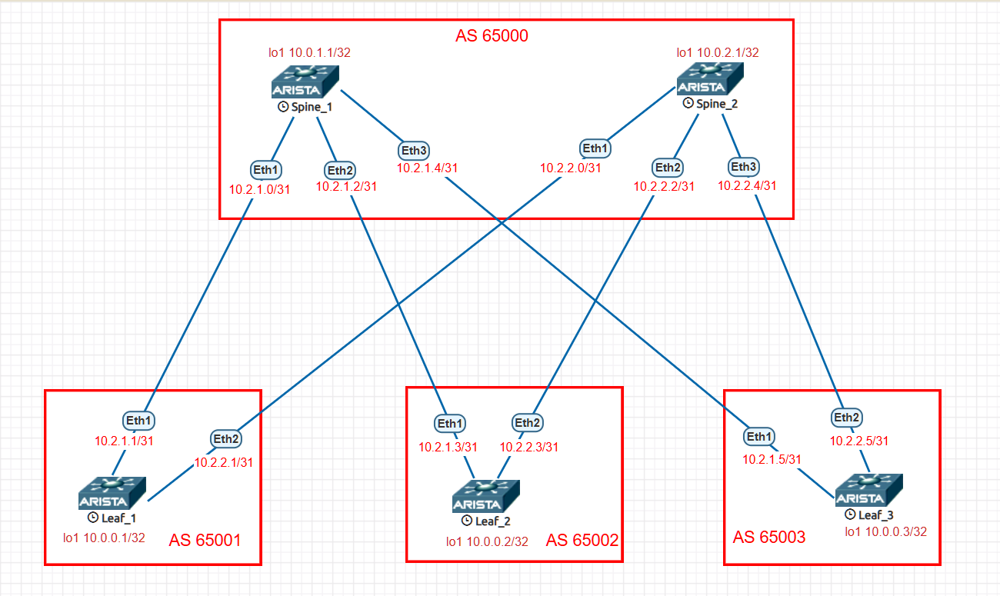

# Underlay. BGP

### Цели:
- Исследовать построение Underlay сети с использованием eBGP.
- Проверить связанность между устройствами

### Адрес план:

|Device|Interface|IP Address|Subnet Mask|Link type
|---|---|---|---|---|
Spine1|lo1|10.0.1.1|255.255.255.255|lo
Spine1 |Eth1|10.2.1.0|255.255.255.254|p2p Spine1 eth1 to Leaf1 eth1
Spine1 |Eth2|10.2.1.2|255.255.255.254|p2p Spine1-eth2 to Leaf2 eth1
Spine1 |Eth3|10.2.1.4|255.255.255.254|p2p Spine1-eth3 to Leaf3-eth1
Spine2 |lo1|10.0.2.1|255.255.255.255|lo
Spine2 |Eth1|10.2.2.0|255.255.255.254|p2p Spine2-eth1 to Leaf1-eth1
Spine2 |Eth2|10.2.2.2|255.255.255.254|p2p Spine2-eth2 to Leaf2-eth2
Spine2 |Eth3|10.2.2.4|255.255.255.254|p2p Spine2-eth3 to Leaf3-eth2
Leaf1 |lo1|10.0.0.1|255.255.255.255|lo
Leaf1 |Eth1|10.2.1.1|255.255.255.254|p2p leaf1-eth1 to Spine1-eth1
Leaf1 |Eth2|10.2.2.1|255.255.255.254|p2p leaf1-eth2 to Spine2-eth1
Leaf2 |lo1|10.0.0.2|255.255.255.255|lo
Leaf2 |Eth1|10.2.1.3|255.255.255.254|p2p leaf2-eth1 to Spine1-eth2
Leaf2 |Eth2|10.2.2.3|255.255.255.254|p2p leaf2-eth2 to Spine2-eth2
Leaf3 |lo1|10.0.0.3|255.255.255.255|lo
Leaf3 |Eth1|10.2.1.5|255.255.255.254|p2p leaf3-eth1 to Spine1-eth3
Leaf3 |Eth2|10.2.2.5|255.255.255.254|p2p leaf3-eth2 to Spine2-eth3
## Выполнение:
### Подготовка оборудования:
- назначаем адреса интерфейсов коммутаторам, согласно адрес плана, переводим интерфейс в L3 режим.
- включаем маршрутизацию
- включаем протокол динамической маршрутизации BGP, назанчаем номер AS
- объявляем в BGP необходимые интерфейсы при помощи карты маршрутов и префикс листаов, анонсируем loopback интерфейс в bgp
- включаем глобальное использование BFD
- Включаем и настраиваем BFD на интерфейсах.

 Конфигурация leaf1 

~~~
hostname Leaf1
!
spanning-tree mode mstp
!
interface Ethernet1
   description p2p leaf1-eth1 to Spine1-eth1
   no switchport
   ip address 10.2.1.1/31
   bfd interval 50 min-rx 50 multiplier 4
!
interface Ethernet2
   description p2p leaf1-eth2 to Spine2-eth1
   no switchport
   ip address 10.2.2.1/31
   bfd interval 50 min-rx 50 multiplier 4
!
interface Ethernet3
!
interface Ethernet4
!
interface Ethernet5
!
interface Ethernet6
!
interface Ethernet7
!
interface Ethernet8
!
interface Loopback1
   ip address 10.0.0.1/32
!
interface Management1
!
ip routing
!
ip prefix-list PL_POOL
   seq 10 permit 10.0.0.1/32
!
route-map RM_REDIS_CON permit 10
   match ip address prefix-list PL_POOL
!
router bgp 65001
   router-id 10.0.0.1
   maximum-paths 10
   neighbor SPINE peer group
   neighbor SPINE remote-as 65000
   neighbor SPINE bfd
   neighbor SPINE timers 3 9
   neighbor 10.2.1.0 peer group SPINE
   neighbor 10.2.2.0 peer group SPINE
   redistribute connected route-map RM_REDIS_CON
!
end

~~~

 Конфигурация leaf2 

~~~
hostname Leaf2
!
spanning-tree mode mstp
!
interface Ethernet1
   description p2p Leaf2-eth1 to Spine1-eth2
   no switchport
   ip address 10.2.1.3/31
   bfd interval 50 min-rx 50 multiplier 4
!
interface Ethernet2
   description p2p leaf2-eth2 to spine2-eth2
   no switchport
   ip address 10.2.2.3/31
   bfd interval 50 min-rx 50 multiplier 4
!
interface Ethernet3
!
interface Ethernet4
!
interface Ethernet5
!
interface Ethernet6
!
interface Ethernet7
!
interface Ethernet8
!
interface Loopback1
   ip address 10.0.0.2/32
!
interface Management1
!
ip routing
!
ip prefix-list PL_POOL
   seq 10 permit 10.0.0.2/32
!
route-map RM_REDIS_CON permit 10
   match ip address prefix-list PL_POOL
!
router bgp 65002
   router-id 10.0.0.2
   maximum-paths 10
   neighbor SPINE peer group
   neighbor SPINE remote-as 65000
   neighbor SPINE bfd
   neighbor SPINE timers 3 9
   neighbor 10.2.1.2 peer group SPINE
   neighbor 10.2.2.2 peer group SPINE
   redistribute connected route-map RM_REDIS_CON
!
end

~~~

 Конфигурация leaf3 

~~~
hostname Leaf3
!
spanning-tree mode mstp
!
interface Ethernet1
   description p2p leaf3-eth1 to spine1-eth3
   no switchport
   ip address 10.2.1.5/31
   bfd interval 50 min-rx 50 multiplier 4
!
interface Ethernet2
   description p2p leaf3-eth2 to spine2-eth3
   no switchport
   ip address 10.2.2.5/31
   bfd interval 50 min-rx 50 multiplier 4
!
interface Ethernet3
!
interface Ethernet4
!
interface Ethernet5
!
interface Ethernet6
!
interface Ethernet7
!
interface Ethernet8
!
interface Loopback1
   ip address 10.0.0.3/32
!
interface Management1
!
ip routing
!
ip prefix-list PL_POOL
   seq 10 permit 10.0.0.3/32
!
route-map RM_REDIS_CON permit 10
   match ip address prefix-list PL_POOL
!
router bgp 65003
   router-id 10.0.0.3
   maximum-paths 10
   neighbor SPINE peer group
   neighbor SPINE remote-as 65000
   neighbor SPINE bfd
   neighbor SPINE timers 3 9
   neighbor 10.2.1.4 peer group SPINE
   neighbor 10.2.2.4 peer group SPINE
   redistribute connected route-map RM_REDIS_CON
!
end

~~~

 Конфигурация spine1 

~~~
hostname Spine1
!
spanning-tree mode mstp
!
interface Ethernet1
   description p2p Spine1_eth1 to Leaf1_eth1
   no switchport
   ip address 10.2.1.0/31
   bfd interval 50 min-rx 50 multiplier 4
   no ip ospf neighbor bfd
!
interface Ethernet2
   description p2p Spine1-eth2 to Leaf2-eth1
   no switchport
   ip address 10.2.1.2/31
   bfd interval 50 min-rx 50 multiplier 4
   no ip ospf neighbor bfd
!
interface Ethernet3
   description p2p Spine1-eth3 to Leaf3-eth1
   no switchport
   ip address 10.2.1.4/31
   bfd interval 50 min-rx 50 multiplier 4
   no ip ospf neighbor bfd
!
interface Ethernet4
!
interface Ethernet5
!
interface Ethernet6
!
interface Ethernet7
!
interface Ethernet8
!
interface Loopback1
   ip address 10.0.1.1/32
!
interface Management1
!
ip routing
!
route-map RM_REDIS_CON permit 10
   match interface Loopback1
!
peer-filter LEAF-AS
   10 match as-range 65001-65003 result accept
!
router bgp 65000
   router-id 10.0.1.1
   maximum-paths 10
   bgp listen range 10.2.1.0/24 peer-group LEAF peer-filter LEAF-AS
   neighbor LEAF peer group
   neighbor LEAF bfd
   redistribute connected route-map RM_REDIS_CON
!
end

~~~

 Конфигурация spine2 

~~~
hostname Spine2
!
spanning-tree mode mstp
!
interface Ethernet1
   description p2p Spine2-eth1 to Leaf1-eth2
   no switchport
   ip address 10.2.2.0/31
   bfd interval 50 min-rx 50 multiplier 4
!
interface Ethernet2
   description p2p Spine2-eth2 to Leaf2-eth2
   no switchport
   ip address 10.2.2.2/31
   bfd interval 50 min-rx 50 multiplier 4
!
interface Ethernet3
   description p2p Spine2-eth3 to Leaf3-eth2
   no switchport
   ip address 10.2.2.4/31
   bfd interval 50 min-rx 50 multiplier 4
!
interface Ethernet4
!
interface Ethernet5
!
interface Ethernet6
!
interface Ethernet7
!
interface Ethernet8
!
interface Loopback1
   ip address 10.0.2.1/32
!
interface Management1
!
ip routing
!
route-map RM_REDIS_CON permit 10
   match interface Loopback1
!
peer-filter LEAF-AS
   10 match as-range 65001-65003 result accept
!
router bgp 65000
   router-id 10.0.2.1
   maximum-paths 10
   bgp listen range 10.2.2.0/24 peer-group LEAF peer-filter LEAF-AS
   neighbor LEAF peer group
   neighbor LEAF bfd
   redistribute connected route-map RM_REDIS_CON
!
end

~~~

### Проверка связности устройств:
Leaf1
~~~
Leaf1#sh ip route 

VRF: default
Codes: C - connected, S - static, K - kernel, 
       O - OSPF, IA - OSPF inter area, E1 - OSPF external type 1,
       E2 - OSPF external type 2, N1 - OSPF NSSA external type 1,
       N2 - OSPF NSSA external type2, B - Other BGP Routes,
       B I - iBGP, B E - eBGP, R - RIP, I L1 - IS-IS level 1,
       I L2 - IS-IS level 2, O3 - OSPFv3, A B - BGP Aggregate,
       A O - OSPF Summary, NG - Nexthop Group Static Route,
       V - VXLAN Control Service, M - Martian,
       DH - DHCP client installed default route,
       DP - Dynamic Policy Route, L - VRF Leaked,
       G  - gRIBI, RC - Route Cache Route

Gateway of last resort is not set

 C        10.0.0.1/32 is directly connected, Loopback1
 B E      10.0.0.2/32 [200/0] via 10.2.2.0, Ethernet2
 B E      10.0.2.1/32 [200/0] via 10.2.2.0, Ethernet2
 C        10.2.1.0/31 is directly connected, Ethernet1
 C        10.2.2.0/31 is directly connected, Ethernet2

Leaf1#sh ip bgp summary 
BGP summary information for VRF default
Router identifier 10.0.0.1, local AS number 65001
Neighbor Status Codes: m - Under maintenance
  Neighbor         V  AS           MsgRcvd   MsgSent  InQ OutQ  Up/Down State   PfxRcd PfxAcc
  10.2.1.0         4  65000          60242     63573    0    0 00:00:04 Estab   3      3
  10.2.2.0         4  65000          25950     29873    0    0 00:00:01 Estab   3      3
Leaf1#sh ip bgp neighbors bfd 
BGP BFD Neighbor Table
Flags: U - BFD is enabled for BGP neighbor and BFD session state is UP
       I - BFD is enabled for BGP neighbor and BFD session state is INIT
       D - BFD is enabled for BGP neighbor and BFD session state is DOWN
       N - BFD is not enabled for BGP neighbor
Neighbor           Interface          Up/Down    State       Flags
10.2.1.0           Ethernet1          00:00:28   Established U    
10.2.2.0           Ethernet2          00:00:25   Established U    

~~~
Leaf2
~~~
Leaf2#sh ip route 

VRF: default
Codes: C - connected, S - static, K - kernel, 
       O - OSPF, IA - OSPF inter area, E1 - OSPF external type 1,
       E2 - OSPF external type 2, N1 - OSPF NSSA external type 1,
       N2 - OSPF NSSA external type2, B - Other BGP Routes,
       B I - iBGP, B E - eBGP, R - RIP, I L1 - IS-IS level 1,
       I L2 - IS-IS level 2, O3 - OSPFv3, A B - BGP Aggregate,
       A O - OSPF Summary, NG - Nexthop Group Static Route,
       V - VXLAN Control Service, M - Martian,
       DH - DHCP client installed default route,
       DP - Dynamic Policy Route, L - VRF Leaked,
       G  - gRIBI, RC - Route Cache Route

Gateway of last resort is not set

 B E      10.0.0.1/32 [200/0] via 10.2.2.2, Ethernet2
 C        10.0.0.2/32 is directly connected, Loopback1
 B E      10.0.2.1/32 [200/0] via 10.2.2.2, Ethernet2
 C        10.2.1.2/31 is directly connected, Ethernet1
 C        10.2.2.2/31 is directly connected, Ethernet2
Leaf2#sh ip bgp summary 
BGP summary information for VRF default
Router identifier 10.0.0.2, local AS number 65002
Neighbor Status Codes: m - Under maintenance
  Neighbor         V  AS           MsgRcvd   MsgSent  InQ OutQ  Up/Down State   PfxRcd PfxAcc
  10.2.1.2         4  65000          59173     62370    0    0 00:00:04 Active         
  10.2.2.2         4  65000          25946     29662    0    0 00:00:04 Active         
Leaf2#sh ip bgp neighbors bfd
BGP BFD Neighbor Table
Flags: U - BFD is enabled for BGP neighbor and BFD session state is UP
       I - BFD is enabled for BGP neighbor and BFD session state is INIT
       D - BFD is enabled for BGP neighbor and BFD session state is DOWN
       N - BFD is not enabled for BGP neighbor
Neighbor           Interface          Up/Down    State       Flags
10.2.1.2           Ethernet1          00:00:03   Established U    
10.2.2.2           Ethernet2          00:00:09   Established U    

~~~
Leaf3
~~~
Leaf3#sh ip route 

VRF: default
Codes: C - connected, S - static, K - kernel, 
       O - OSPF, IA - OSPF inter area, E1 - OSPF external type 1,
       E2 - OSPF external type 2, N1 - OSPF NSSA external type 1,
       N2 - OSPF NSSA external type2, B - Other BGP Routes,
       B I - iBGP, B E - eBGP, R - RIP, I L1 - IS-IS level 1,
       I L2 - IS-IS level 2, O3 - OSPFv3, A B - BGP Aggregate,
       A O - OSPF Summary, NG - Nexthop Group Static Route,
       V - VXLAN Control Service, M - Martian,
       DH - DHCP client installed default route,
       DP - Dynamic Policy Route, L - VRF Leaked,
       G  - gRIBI, RC - Route Cache Route

Gateway of last resort is not set

 B E      10.0.0.1/32 [200/0] via 10.2.2.4, Ethernet2
 B E      10.0.0.2/32 [200/0] via 10.2.2.4, Ethernet2
 C        10.0.0.3/32 is directly connected, Loopback1
 B E      10.0.2.1/32 [200/0] via 10.2.2.4, Ethernet2
 C        10.2.1.4/31 is directly connected, Ethernet1
 C        10.2.2.4/31 is directly connected, Ethernet2
Leaf3#sh ip bgp summary
BGP summary information for VRF default
Router identifier 10.0.0.3, local AS number 65003
Neighbor Status Codes: m - Under maintenance
  Neighbor         V  AS           MsgRcvd   MsgSent  InQ OutQ  Up/Down State   PfxRcd PfxAcc
  10.2.1.4         4  65000          26415     30072    0    0 00:00:03 Estab   2      2
  10.2.2.4         4  65000          26092     29849    0    0 00:00:00 Estab   2      2
Leaf3#sh ip bgp neighbors bfd
BGP BFD Neighbor Table
Flags: U - BFD is enabled for BGP neighbor and BFD session state is UP
       I - BFD is enabled for BGP neighbor and BFD session state is INIT
       D - BFD is enabled for BGP neighbor and BFD session state is DOWN
       N - BFD is not enabled for BGP neighbor
Neighbor           Interface          Up/Down    State       Flags
10.2.1.4           Ethernet1          00:00:04   Established U    
10.2.2.4           Ethernet2          00:00:00   Established U    

~~~
Spine1
~~~
Spine1#sh ip route 

VRF: default
Codes: C - connected, S - static, K - kernel, 
       O - OSPF, IA - OSPF inter area, E1 - OSPF external type 1,
       E2 - OSPF external type 2, N1 - OSPF NSSA external type 1,
       N2 - OSPF NSSA external type2, B - Other BGP Routes,
       B I - iBGP, B E - eBGP, R - RIP, I L1 - IS-IS level 1,
       I L2 - IS-IS level 2, O3 - OSPFv3, A B - BGP Aggregate,
       A O - OSPF Summary, NG - Nexthop Group Static Route,
       V - VXLAN Control Service, M - Martian,
       DH - DHCP client installed default route,
       DP - Dynamic Policy Route, L - VRF Leaked,
       G  - gRIBI, RC - Route Cache Route

Gateway of last resort is not set

 B E      10.0.0.1/32 [200/0] via 10.2.1.1, Ethernet1
 B E      10.0.0.2/32 [200/0] via 10.2.1.3, Ethernet2
 B E      10.0.0.3/32 [200/0] via 10.2.1.5, Ethernet3
 C        10.0.1.1/32 is directly connected, Loopback1
 C        10.2.1.0/31 is directly connected, Ethernet1
 C        10.2.1.2/31 is directly connected, Ethernet2
 C        10.2.1.4/31 is directly connected, Ethernet3

Spine1#sh ip bgp summary 
BGP summary information for VRF default
Router identifier 10.0.1.1, local AS number 65000
Neighbor Status Codes: m - Under maintenance
  Neighbor         V  AS           MsgRcvd   MsgSent  InQ OutQ  Up/Down State   PfxRcd PfxAcc
  10.2.1.3         4  65002              7         6    0    0 00:00:02 Estab   1      1
  10.2.1.5         4  65003              5         6    0    0 00:00:01 Estab   1      1

Spine1#sh ip bgp neighbors bfd 
BGP BFD Neighbor Table
Flags: U - BFD is enabled for BGP neighbor and BFD session state is UP
       I - BFD is enabled for BGP neighbor and BFD session state is INIT
       D - BFD is enabled for BGP neighbor and BFD session state is DOWN
       N - BFD is not enabled for BGP neighbor
Neighbor           Interface          Up/Down    State       Flags
10.2.1.1           Ethernet1          00:00:27   Established U    
10.2.1.3           Ethernet2          00:00:27   Established U    
10.2.1.5           Ethernet3          00:00:19   Established U    

~~~
Spine2
~~~
Spine2#sh ip route 

VRF: default
Codes: C - connected, S - static, K - kernel, 
       O - OSPF, IA - OSPF inter area, E1 - OSPF external type 1,
       E2 - OSPF external type 2, N1 - OSPF NSSA external type 1,
       N2 - OSPF NSSA external type2, B - Other BGP Routes,
       B I - iBGP, B E - eBGP, R - RIP, I L1 - IS-IS level 1,
       I L2 - IS-IS level 2, O3 - OSPFv3, A B - BGP Aggregate,
       A O - OSPF Summary, NG - Nexthop Group Static Route,
       V - VXLAN Control Service, M - Martian,
       DH - DHCP client installed default route,
       DP - Dynamic Policy Route, L - VRF Leaked,
       G  - gRIBI, RC - Route Cache Route

Gateway of last resort is not set

 B E      10.0.0.1/32 [200/0] via 10.2.2.1, Ethernet1
 B E      10.0.0.2/32 [200/0] via 10.2.2.3, Ethernet2
 B E      10.0.0.3/32 [200/0] via 10.2.2.5, Ethernet3
 C        10.0.2.1/32 is directly connected, Loopback1
 C        10.2.2.0/31 is directly connected, Ethernet1
 C        10.2.2.2/31 is directly connected, Ethernet2
 C        10.2.2.4/31 is directly connected, Ethernet3

Spine2#sh ip bgp summary 
BGP summary information for VRF default
Router identifier 10.0.2.1, local AS number 65000
Neighbor Status Codes: m - Under maintenance
  Neighbor         V  AS           MsgRcvd   MsgSent  InQ OutQ  Up/Down State   PfxRcd PfxAcc
  10.2.2.1         4  65001             23        23    0    0 00:00:48 Estab   1      1
  10.2.2.3         4  65002             25        23    0    0 00:00:48 Estab   1      1
  10.2.2.5         4  65003             24        22    0    0 00:00:46 Estab   1      1

Spine2#sh ip bgp neighbors bfd
BGP BFD Neighbor Table
Flags: U - BFD is enabled for BGP neighbor and BFD session state is UP
       I - BFD is enabled for BGP neighbor and BFD session state is INIT
       D - BFD is enabled for BGP neighbor and BFD session state is DOWN
       N - BFD is not enabled for BGP neighbor
Neighbor           Interface          Up/Down    State       Flags
10.2.2.1           Ethernet1          00:00:01   Established U    
10.2.2.3           Ethernet2          00:00:01   Established U    
10.2.2.5           Ethernet3          00:00:01   Established U    

~~~