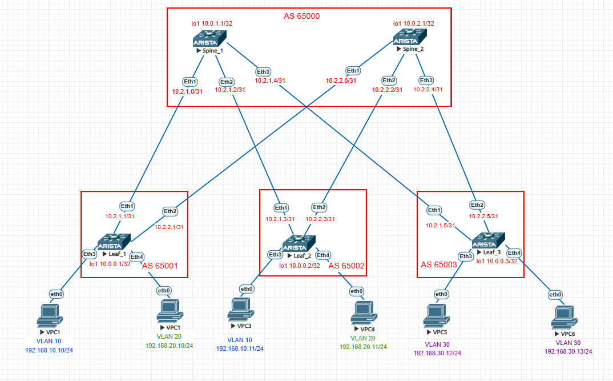

# Overlay. VxLAN EVPN L3

### Цели:
- рассмотреть возможности маршрутизации с использованием EVPN между различными VNI.
- Проверить связанность между клиентами

### Адрес план:

|Device|Interface|IP Address|Subnet Mask|Link type
|---|---|---|---|---|
Spine1|lo1|10.0.1.1|255.255.255.255|lo
Spine1 |Eth1|10.2.1.0|255.255.255.254|p2p Spine1 eth1 to Leaf1 eth1
Spine1 |Eth2|10.2.1.2|255.255.255.254|p2p Spine1-eth2 to Leaf2 eth1
Spine1 |Eth3|10.2.1.4|255.255.255.254|p2p Spine1-eth3 to Leaf3-eth1
Spine2 |lo1|10.0.2.1|255.255.255.255|lo
Spine2 |Eth1|10.2.2.0|255.255.255.254|p2p Spine2-eth1 to Leaf1-eth1
Spine2 |Eth2|10.2.2.2|255.255.255.254|p2p Spine2-eth2 to Leaf2-eth2
Spine2 |Eth3|10.2.2.4|255.255.255.254|p2p Spine2-eth3 to Leaf3-eth2
Leaf1 |lo1|10.0.0.1|255.255.255.255|lo
Leaf1 |Eth1|10.2.1.1|255.255.255.254|p2p leaf1-eth1 to Spine1-eth1
Leaf1 |Eth2|10.2.2.1|255.255.255.254|p2p leaf1-eth2 to Spine2-eth1
Leaf2 |lo1|10.0.0.2|255.255.255.255|lo
Leaf2 |Eth1|10.2.1.3|255.255.255.254|p2p leaf2-eth1 to Spine1-eth2
Leaf2 |Eth2|10.2.2.3|255.255.255.254|p2p leaf2-eth2 to Spine2-eth2
Leaf3 |lo1|10.0.0.3|255.255.255.255|lo
Leaf3 |Eth1|10.2.1.5|255.255.255.254|p2p leaf3-eth1 to Spine1-eth3
Leaf3 |Eth2|10.2.2.5|255.255.255.254|p2p leaf3-eth2 to Spine2-eth3
VPC1  |Eth0|192.168.10.10|255.255.255.0|VPC1_vlan10-eth0 to Leaf1-eth3
VPC2  |Eth0|192.168.20.10|255.255.255.0|VPC2_vlan20-eth0 to Leaf1-eth4
VPC3  |Eth0|192.168.10.11|255.255.255.0|VPC3_vlan10-eth0 to Leaf2-eth3
VPC4  |Eth0|192.168.20.11|255.255.255.0|VPC4_vlan20-eth0 to Leaf2-eth4
VPC5  |Eth0|192.168.30.12|255.255.255.0|VPC5_vlan30-eth0 to Leaf3-eth3
VPC6  |Eth0|192.168.30.13|255.255.255.0|VPC6_vlan30-eth0 to Leaf3-eth4

## Выполнение:
### Подготовка оборудования:
- назначаем адреса интерфейсов коммутаторам, согласно адрес плана, переводим интерфейс в L3 режим.
- включаем маршрутизацию
- включаем протокол динамической маршрутизации BGP, назанчаем номер AS
- объявляем в BGP необходимые интерфейсы при помощи карты маршрутов и префикс листаов, анонсируем loopback интерфейс в bgp
- включаем глобальное использование BFD
- Включаем и настраиваем BFD на интерфейсах.
- создаем интерфейс VxVlan 1
- создаем VRF "Host" для клиентов
- настраиваем L3 на интерфейсах хостов и включаем их в VRF
- назначаем адреса всем VPC, сошласно адрес-плана
- Объявляем в BGP созданные vlan, указываем route-distinguisher, route-target а так же Vrf
- Включить "service routing protocols model multi-agent"

 Конфигурация leaf1 

~~~
hostname Leaf1
!
spanning-tree mode mstp
!
vlan 10,20
!
vrf instance Host
!
vrf instance host
!
interface Ethernet1
   description p2p leaf1-eth1 to Spine1-eth1
   no switchport
   ip address 10.2.1.1/31
   bfd interval 100 min-rx 100 multiplier 3
!
interface Ethernet2
   description p2p leaf1-eth2 to Spine2-eth1
   no switchport
   ip address 10.2.2.1/31
   bfd interval 100 min-rx 100 multiplier 3
!
interface Ethernet3
   description to-pc1
   mtu 9000
   switchport access vlan 10
!
interface Ethernet4
   description to-pc2
   mtu 9000
   switchport access vlan 20
!
interface Ethernet5
!
interface Ethernet6
!
interface Ethernet7
!
interface Ethernet8
!
interface Loopback1
   ip address 10.0.0.1/32
!
interface Management1
!
interface Vlan10
   vrf Host
   ip address virtual 192.168.10.1/24
!
interface Vlan20
   vrf Host
   ip address virtual 192.168.20.1/24
!
interface Vxlan1
   vxlan source-interface Loopback1
   vxlan udp-port 4789
   vxlan vlan 10 vni 10010
   vxlan vlan 20 vni 10020
   vxlan vrf Host vni 777
!
ip virtual-router mac-address 00:00:00:00:00:01
!
ip routing
ip routing vrf Host
no ip routing vrf host
!
ip prefix-list PL_POOL
   seq 10 permit 10.0.0.1/32
!
route-map RM_REDIS_CON permit 10
   match ip address prefix-list PL_POOL
!
router bgp 65001
   router-id 10.0.0.1
   maximum-paths 10
   neighbor EVPN peer group
   neighbor EVPN remote-as 65000
   neighbor EVPN update-source Loopback1
   neighbor EVPN ebgp-multihop 5
   neighbor EVPN send-community extended
   neighbor SPINE peer group
   neighbor SPINE remote-as 65000
   neighbor SPINE timers 3 9
   neighbor 10.0.1.1 peer group EVPN
   neighbor 10.0.2.1 peer group EVPN
   neighbor 10.2.1.0 peer group SPINE
   neighbor 10.2.2.0 peer group SPINE
   redistribute connected route-map RM_REDIS_CON
   !
   vlan 10
      rd 10.0.0.1:10010
      route-target both 10:10010
      redistribute learned
   !
   vlan 20
      rd 10.0.0.1:10020
      route-target both 20:10020
      redistribute learned
   !
   address-family evpn
      neighbor EVPN activate
   !
   address-family ipv4
      neighbor SPINE activate
   !
   vrf Host
      rd 65001:777
      route-target import evpn 777:777
      route-target export evpn 777:777
!
end

~~~

 Конфигурация leaf2 

~~~
hostname Leaf2
!
spanning-tree mode mstp
!
vlan 10,20
!
vrf instance Host
!
interface Ethernet1
   description p2p Leaf2-eth1 to Spine1-eth2
   no switchport
   ip address 10.2.1.3/31
   bfd interval 100 min-rx 100 multiplier 3
!
interface Ethernet2
   description p2p leaf2-eth2 to spine2-eth2
   no switchport
   ip address 10.2.2.3/31
   bfd interval 100 min-rx 100 multiplier 3
!
interface Ethernet3
   description to-pc3
   mtu 9000
   switchport access vlan 10
!
interface Ethernet4
   description to-pc4
   mtu 9000
   switchport access vlan 20
!
interface Ethernet5
!
interface Ethernet6
!
interface Ethernet7
!
interface Ethernet8
!
interface Loopback1
   ip address 10.0.0.2/32
!
interface Management1
!
interface Vlan10
   vrf Host
   ip address virtual 192.168.10.1/24
!
interface Vlan20
   vrf Host
   ip address virtual 192.168.20.1/24
!
interface Vxlan1
   vxlan source-interface Loopback1
   vxlan udp-port 4789
   vxlan vlan 10 vni 10010
   vxlan vlan 20 vni 10020
   vxlan vrf Host vni 777
!
ip virtual-router mac-address 00:00:00:00:00:01
!
ip routing
ip routing vrf Host
!
ip prefix-list PL_POOL
   seq 10 permit 10.0.0.2/32
!
route-map RM_REDIS_CON permit 10
   match ip address prefix-list PL_POOL
!
router bgp 65002
   router-id 10.0.0.2
   maximum-paths 10
   neighbor EVPN peer group
   neighbor EVPN remote-as 65000
   neighbor EVPN update-source Loopback1
   neighbor EVPN ebgp-multihop 5
   neighbor EVPN send-community extended
   neighbor SPINE peer group
   neighbor SPINE remote-as 65000
   neighbor SPINE bfd
   neighbor SPINE timers 3 9
   neighbor 10.0.1.1 peer group EVPN
   neighbor 10.0.2.1 peer group EVPN
   neighbor 10.2.1.2 peer group SPINE
   neighbor 10.2.2.2 peer group SPINE
   redistribute connected route-map RM_REDIS_CON
   !
   vlan 10
      rd 10.0.0.2:10010
      route-target both 10:10010
      redistribute learned
   !
   vlan 20
      rd 10.0.0.2:10020
      route-target both 20:10020
      redistribute learned
   !
   address-family evpn
      neighbor EVPN activate
   !
   address-family ipv4
      neighbor SPINE activate
   !
   vrf Host
      rd 65002:777
      route-target import evpn 777:777
      route-target export evpn 777:777
!
end

~~~

 Конфигурация leaf3 

~~~
hostname Leaf3
!
spanning-tree mode mstp
!
vlan 30
!
vrf instance Host
!
interface Ethernet1
   description p2p leaf3-eth1 to spine1-eth3
   no switchport
   ip address 10.2.1.5/31
   bfd interval 100 min-rx 100 multiplier 3
!
interface Ethernet2
   description p2p leaf3-eth2 to spine2-eth3
   no switchport
   ip address 10.2.2.5/31
   bfd interval 100 min-rx 100 multiplier 3
!
interface Ethernet3
   description to-pc5
   mtu 9000
   switchport access vlan 30
!
interface Ethernet4
   description to-pc6
   mtu 9000
   switchport access vlan 30
!
interface Ethernet5
!
interface Ethernet6
!
interface Ethernet7
!
interface Ethernet8
!
interface Loopback1
   ip address 10.0.0.3/32
!
interface Management1
!
interface Vlan30
   vrf Host
   ip address virtual 192.168.30.1/24
!
interface Vxlan1
   vxlan source-interface Loopback1
   vxlan udp-port 4789
   vxlan vlan 30 vni 10030
   vxlan vrf Host vni 777
!
ip virtual-router mac-address 00:00:00:00:00:03
!
ip routing
ip routing vrf Host
!
ip prefix-list PL_POOL
   seq 10 permit 10.0.0.3/32
!
route-map RM_REDIS_CON permit 10
   match ip address prefix-list PL_POOL
!
router bgp 65003
   router-id 10.0.0.3
   maximum-paths 10
   neighbor EVPN peer group
   neighbor EVPN remote-as 65000
   neighbor EVPN update-source Loopback1
   neighbor EVPN ebgp-multihop 5
   neighbor EVPN send-community extended
   neighbor SPINE peer group
   neighbor SPINE remote-as 65000
   neighbor SPINE bfd
   neighbor SPINE timers 3 9
   neighbor 10.0.1.1 peer group EVPN
   neighbor 10.0.2.1 peer group EVPN
   neighbor 10.2.1.4 peer group SPINE
   neighbor 10.2.2.4 peer group SPINE
   redistribute connected route-map RM_REDIS_CON
   !
   vlan 30
      rd 10.0.0.3:10030
      route-target both 30:30
      route-target both 30:10030
      redistribute learned
   !
   address-family evpn
      neighbor EVPN activate
   !
   address-family ipv4
      neighbor SPINE activate
   !
   vrf Host
      rd 65003:777
      route-target import evpn 777:777
      route-target export evpn 777:777
!
end

~~~

 Конфигурация spine1 

~~~
hostname Spine1
!
spanning-tree mode mstp
!
interface Ethernet1
   description p2p Spine1_eth1 to Leaf1_eth1
   no switchport
   ip address 10.2.1.0/31
   bfd interval 100 min-rx 100 multiplier 3
   no ip ospf neighbor bfd
!
interface Ethernet2
   description p2p Spine1-eth2 to Leaf2-eth1
   no switchport
   ip address 10.2.1.2/31
   bfd interval 100 min-rx 100 multiplier 3
   no ip ospf neighbor bfd
!
interface Ethernet3
   description p2p Spine1-eth3 to Leaf3-eth1
   no switchport
   ip address 10.2.1.4/31
   bfd interval 100 min-rx 100 multiplier 3
   no ip ospf neighbor bfd
!
interface Ethernet4
!
interface Ethernet5
!
interface Ethernet6
!
interface Ethernet7
!
interface Ethernet8
!
interface Loopback1
   ip address 10.0.1.1/32
!
interface Management1
!
ip routing
!
route-map RM_REDIS_CON permit 10
   match interface Loopback1
!
peer-filter EVPN
   10 match as-range 65001-65003 result accept
!
peer-filter LEAF-AS
   10 match as-range 65001-65003 result accept
!
router bgp 65000
   router-id 10.0.1.1
   maximum-paths 10
   bgp listen range 10.0.0.0/24 peer-group EVPN peer-filter EVPN
   bgp listen range 10.2.1.0/24 peer-group LEAF peer-filter LEAF-AS
   neighbor EVPN peer group
   neighbor EVPN next-hop-unchanged
   neighbor EVPN update-source Loopback1
   neighbor EVPN ebgp-multihop 3
   neighbor EVPN send-community extended
   neighbor LEAF peer group
   redistribute connected route-map RM_REDIS_CON
   !
   address-family evpn
      neighbor EVPN activate
   !
   address-family ipv4
      neighbor LEAF activate
!
end

~~~

 Конфигурация spine2 

~~~
hostname Spine2
!
spanning-tree mode mstp
!
interface Ethernet1
   description p2p Spine2-eth1 to Leaf1-eth2
   no switchport
   ip address 10.2.2.0/31
   bfd interval 100 min-rx 100 multiplier 3
!
interface Ethernet2
   description p2p Spine2-eth2 to Leaf2-eth2
   no switchport
   ip address 10.2.2.2/31
   bfd interval 100 min-rx 100 multiplier 3
!
interface Ethernet3
   description p2p Spine2-eth3 to Leaf3-eth2
   no switchport
   ip address 10.2.2.4/31
   bfd interval 100 min-rx 100 multiplier 3
!
interface Ethernet4
!
interface Ethernet5
!
interface Ethernet6
!
interface Ethernet7
!
interface Ethernet8
!
interface Loopback1
   ip address 10.0.2.1/32
!
interface Management1
!
ip routing
!
route-map RM_REDIS_CON permit 10
   match interface Loopback1
!
peer-filter EVPN
   10 match as-range 65001-65003 result accept
!
peer-filter LEAF-AS
   10 match as-range 65001-65003 result accept
!
router bgp 65000
   router-id 10.0.2.1
   maximum-paths 10
   bgp listen range 10.0.0.0/24 peer-group EVPN peer-filter EVPN
   bgp listen range 10.2.2.0/24 peer-group LEAF peer-filter LEAF-AS
   neighbor EVPN peer group
   neighbor EVPN next-hop-unchanged
   neighbor EVPN update-source Loopback1
   neighbor EVPN ebgp-multihop 3
   neighbor EVPN send-community extended
   neighbor LEAF peer group
   redistribute connected route-map RM_REDIS_CON
   !
   address-family evpn
      neighbor EVPN activate
   !
   address-family ipv4
      neighbor LEAF activate
!
end

~~~

### Проверка связности устройств:
Leaf1
~~~
Leaf1#sh ip route vrf Host
 C        192.168.10.0/24 is directly connected, Vlan10
 B E      192.168.20.11/32 [200/0] via VTEP 10.0.0.2 VNI 777 router-mac 50:00:00:03:37:66 local-interface Vxlan1
 C        192.168.20.0/24 is directly connected, Vlan20

Leaf1#sh bgp evpn route-type mac-ip
BGP routing table information for VRF default
Router identifier 10.0.0.1, local AS number 65001
Route status codes: * - valid, > - active, S - Stale, E - ECMP head, e - ECMP
                    c - Contributing to ECMP, % - Pending BGP convergence
Origin codes: i - IGP, e - EGP, ? - incomplete
AS Path Attributes: Or-ID - Originator ID, C-LST - Cluster List, LL Nexthop - Link Local Nexthop

          Network                Next Hop              Metric  LocPref Weight  Path
 * >      RD: 10.0.0.1:10010 mac-ip 0050.7966.6806
                                 -                     -       -       0       i
 * >      RD: 10.0.0.1:10010 mac-ip 0050.7966.6806 192.168.10.10
                                 -                     -       -       0       i
 * >Ec    RD: 10.0.0.2:10020 mac-ip 0050.7966.6809
                                 10.0.0.2              -       100     0       65000 65002 i
 *  ec    RD: 10.0.0.2:10020 mac-ip 0050.7966.6809
                                 10.0.0.2              -       100     0       65000 65002 i
 * >Ec    RD: 10.0.0.2:10020 mac-ip 0050.7966.6809 192.168.20.11
                                 10.0.0.2              -       100     0       65000 65002 i
 *  ec    RD: 10.0.0.2:10020 mac-ip 0050.7966.6809 192.168.20.11
                                 10.0.0.2              -       100     0       65000 65002 i

Leaf1#sh arp vrf Host 
Address         Age (sec)  Hardware Addr   Interface
192.168.10.10     0:03:30  0050.7966.6806  Vlan10, Ethernet3
192.168.20.10     3:23:59  0050.7966.6807  Vlan20, not learned
192.168.20.11           -  0050.7966.6809  Vlan20, Vxlan1

Leaf1#show vxlan vni
VNI to VLAN Mapping for Vxlan1
VNI         VLAN       Source       Interface       802.1Q Tag
----------- ---------- ------------ --------------- ----------
10010       10         static       Ethernet3       untagged  
                                    Vxlan1          10        
10020       20         static       Ethernet4       untagged  
                                    Vxlan1          20        
VNI to dynamic VLAN Mapping for Vxlan1
VNI       VLAN       VRF        Source       
--------- ---------- ---------- ------------ 
777       4094       Host       evpn         

~~~
Leaf2
~~~
Leaf2#sh ip route vrf Host
 B E      192.168.10.10/32 [200/0] via VTEP 10.0.0.1 VNI 777 router-mac 50:00:00:d5:5d:c0 local-interface Vxlan1
 C        192.168.10.0/24 is directly connected, Vlan10
 C        192.168.20.0/24 is directly connected, Vlan20
 B E      192.168.30.12/32 [200/0] via VTEP 10.0.0.3 VNI 777 router-mac 50:00:00:15:f4:e8 local-interface Vxlan1

 Leaf2#sh arp vrf Host 
Address         Age (sec)  Hardware Addr   Interface
192.168.10.10           -  0050.7966.6806  Vlan10, Vxlan1
192.168.10.11     0:17:15  0050.7966.6808  Vlan10, not learned
192.168.20.11     0:04:16  0050.7966.6809  Vlan20, Ethernet4
Leaf2#sh bgp evpn route-type mac-ip
BGP routing table information for VRF default
Router identifier 10.0.0.2, local AS number 65002
Route status codes: * - valid, > - active, S - Stale, E - ECMP head, e - ECMP
                    c - Contributing to ECMP, % - Pending BGP convergence
Origin codes: i - IGP, e - EGP, ? - incomplete
AS Path Attributes: Or-ID - Originator ID, C-LST - Cluster List, LL Nexthop - Link Local Nexthop

          Network                Next Hop              Metric  LocPref Weight  Path
 * >Ec    RD: 10.0.0.1:10010 mac-ip 0050.7966.6806
                                 10.0.0.1              -       100     0       65000 65001 i
 *  ec    RD: 10.0.0.1:10010 mac-ip 0050.7966.6806
                                 10.0.0.1              -       100     0       65000 65001 i
 * >Ec    RD: 10.0.0.1:10010 mac-ip 0050.7966.6806 192.168.10.10
                                 10.0.0.1              -       100     0       65000 65001 i
 *  ec    RD: 10.0.0.1:10010 mac-ip 0050.7966.6806 192.168.10.10
                                 10.0.0.1              -       100     0       65000 65001 i
 * >      RD: 10.0.0.2:10020 mac-ip 0050.7966.6809
                                 -                     -       -       0       i
 * >      RD: 10.0.0.2:10020 mac-ip 0050.7966.6809 192.168.20.11
                                 -                     -       -       0       i
 * >Ec    RD: 10.0.0.3:10030 mac-ip 0050.7966.680a
                                 10.0.0.3              -       100     0       65000 65003 i
 *  ec    RD: 10.0.0.3:10030 mac-ip 0050.7966.680a
                                 10.0.0.3              -       100     0       65000 65003 i
 * >Ec    RD: 10.0.0.3:10030 mac-ip 0050.7966.680a 192.168.30.12
                                 10.0.0.3              -       100     0       65000 65003 i
 *  ec    RD: 10.0.0.3:10030 mac-ip 0050.7966.680a 192.168.30.12
                                 10.0.0.3              -       100     0       65000 65003 i
Leaf2#show vxlan vni
VNI to VLAN Mapping for Vxlan1
VNI         VLAN       Source       Interface       802.1Q Tag
----------- ---------- ------------ --------------- ----------
10010       10         static       Ethernet3       untagged  
                                    Vxlan1          10        
10020       20         static       Ethernet4       untagged  
                                    Vxlan1          20        

VNI to dynamic VLAN Mapping for Vxlan1
VNI       VLAN       VRF        Source       
--------- ---------- ---------- ------------ 
777       4094       Host       evpn         

~~~
Leaf3
~~~
Leaf3#sh ip route vrf Host

 B E      192.168.20.11/32 [200/0] via VTEP 10.0.0.2 VNI 777 router-mac 50:00:00:03:37:66 local-interface Vxlan1
 C        192.168.30.0/24 is directly connected, Vlan30

Leaf3#sh arp vrf Host
Address         Age (sec)  Hardware Addr   Interface
192.168.30.12     0:01:28  0050.7966.680a  Vlan30, Ethernet3
192.168.30.13     0:01:59  0050.7966.680b  Vlan30, Ethernet4

Leaf3#sh bgp evpn route-type mac-ip
BGP routing table information for VRF default
Router identifier 10.0.0.3, local AS number 65003
Route status codes: * - valid, > - active, S - Stale, E - ECMP head, e - ECMP
                    c - Contributing to ECMP, % - Pending BGP convergence
Origin codes: i - IGP, e - EGP, ? - incomplete
AS Path Attributes: Or-ID - Originator ID, C-LST - Cluster List, LL Nexthop - Link Local Nexthop

          Network                Next Hop              Metric  LocPref Weight  Path
 * >Ec    RD: 10.0.0.2:10020 mac-ip 0050.7966.6809
                                 10.0.0.2              -       100     0       65000 65002 i
 *  ec    RD: 10.0.0.2:10020 mac-ip 0050.7966.6809
                                 10.0.0.2              -       100     0       65000 65002 i
 * >Ec    RD: 10.0.0.2:10020 mac-ip 0050.7966.6809 192.168.20.11
                                 10.0.0.2              -       100     0       65000 65002 i
 *  ec    RD: 10.0.0.2:10020 mac-ip 0050.7966.6809 192.168.20.11
                                 10.0.0.2              -       100     0       65000 65002 i
 * >      RD: 10.0.0.3:10030 mac-ip 0050.7966.680a
                                 -                     -       -       0       i
 * >      RD: 10.0.0.3:10030 mac-ip 0050.7966.680a 192.168.30.12
                                 -                     -       -       0       i
 * >      RD: 10.0.0.3:10030 mac-ip 0050.7966.680b
                                 -                     -       -       0       i
 * >      RD: 10.0.0.3:10030 mac-ip 0050.7966.680b 192.168.30.13
                                 -                     -       -       0       i
Leaf3#show vxlan vni
VNI to VLAN Mapping for Vxlan1
VNI         VLAN       Source       Interface       802.1Q Tag
----------- ---------- ------------ --------------- ----------
10030       30         static       Ethernet3       untagged  
                                    Ethernet4       untagged  
                                    Vxlan1          30        

VNI to dynamic VLAN Mapping for Vxlan1
VNI       VLAN       VRF        Source       
--------- ---------- ---------- ------------ 
777       4094       Host       evpn         

~~~

Проверем доступность клиентов между друш другом.
VPCS> show ip
NAME        : VPCS[4]
IP/MASK     : 192.168.20.11/24
GATEWAY     : 192.168.20.1
DNS         : 
MAC         : 00:50:79:66:68:09
LPORT       : 20000
RHOST:PORT  : 127.0.0.1:30000
MTU         : 1500
VPCS> ping 192.168.30.12
84 bytes from 192.168.30.12 icmp_seq=1 ttl=62 time=123.009 ms
84 bytes from 192.168.30.12 icmp_seq=2 ttl=62 time=49.701 ms
84 bytes from 192.168.30.12 icmp_seq=3 ttl=62 time=55.766 ms
84 bytes from 192.168.30.12 icmp_seq=4 ttl=62 time=50.596 ms
84 bytes from 192.168.30.12 icmp_seq=5 ttl=62 time=50.996 ms

NAME        : VPCS[1]
IP/MASK     : 192.168.10.10/24
GATEWAY     : 192.168.10.1
DNS         : 
MAC         : 00:50:79:66:68:06
LPORT       : 20000
RHOST:PORT  : 127.0.0.1:30000
MTU         : 1500

VPCS> ping 192.168.30.13

192.168.30.13 icmp_seq=1 timeout
84 bytes from 192.168.30.13 icmp_seq=2 ttl=62 time=70.359 ms
84 bytes from 192.168.30.13 icmp_seq=3 ttl=62 time=60.278 ms
84 bytes from 192.168.30.13 icmp_seq=4 ttl=62 time=49.558 ms
84 bytes from 192.168.30.13 icmp_seq=5 ttl=62 time=46.827 ms

NAME        : VPCS[5]
IP/MASK     : 192.168.30.12/24
GATEWAY     : 192.168.30.1
DNS         : 
MAC         : 00:50:79:66:68:0a
LPORT       : 20000
RHOST:PORT  : 127.0.0.1:30000
MTU         : 1500

VPCS> ping 192.168.10.10

84 bytes from 192.168.10.10 icmp_seq=1 ttl=62 time=371.865 ms
84 bytes from 192.168.10.10 icmp_seq=2 ttl=62 time=60.507 ms
84 bytes from 192.168.10.10 icmp_seq=3 ttl=62 time=148.622 ms
84 bytes from 192.168.10.10 icmp_seq=4 ttl=62 time=50.489 ms
84 bytes from 192.168.10.10 icmp_seq=5 ttl=62 time=45.681 ms