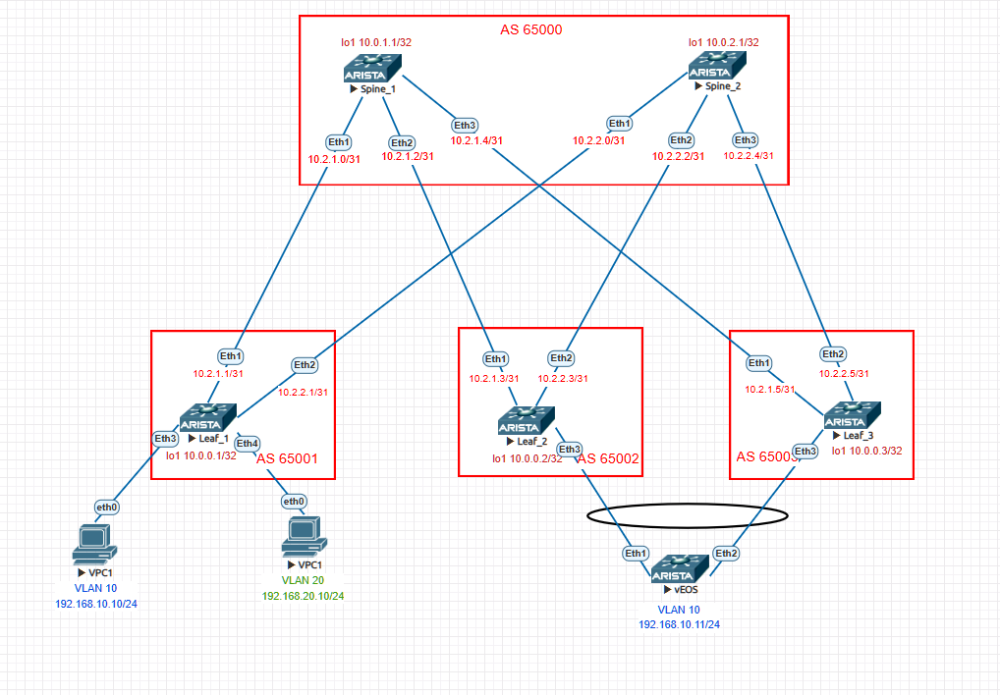

# VXLAN. Multihoming.

### Цели:
- Настроить отказоустойчивое подключение клиентов с использованием EVPN Multihoming

### Адрес план:

|Device|Interface|IP Address|Subnet Mask|Link type
|---|---|---|---|---|
Spine1|lo1|10.0.1.1|255.255.255.255|lo
Spine1 |Eth1|10.2.1.0|255.255.255.254|p2p Spine1 eth1 to Leaf1 eth1
Spine1 |Eth2|10.2.1.2|255.255.255.254|p2p Spine1-eth2 to Leaf2 eth1
Spine1 |Eth3|10.2.1.4|255.255.255.254|p2p Spine1-eth3 to Leaf3-eth1
Spine2 |lo1|10.0.2.1|255.255.255.255|lo
Spine2 |Eth1|10.2.2.0|255.255.255.254|p2p Spine2-eth1 to Leaf1-eth1
Spine2 |Eth2|10.2.2.2|255.255.255.254|p2p Spine2-eth2 to Leaf2-eth2
Spine2 |Eth3|10.2.2.4|255.255.255.254|p2p Spine2-eth3 to Leaf3-eth2
Leaf1 |lo1|10.0.0.1|255.255.255.255|lo
Leaf1 |Eth1|10.2.1.1|255.255.255.254|p2p leaf1-eth1 to Spine1-eth1
Leaf1 |Eth2|10.2.2.1|255.255.255.254|p2p leaf1-eth2 to Spine2-eth1
Leaf2 |lo1|10.0.0.2|255.255.255.255|lo
Leaf2 |Eth1|10.2.1.3|255.255.255.254|p2p leaf2-eth1 to Spine1-eth2
Leaf2 |Eth2|10.2.2.3|255.255.255.254|p2p leaf2-eth2 to Spine2-eth2
Leaf3 |lo1|10.0.0.3|255.255.255.255|lo
Leaf3 |Eth1|10.2.1.5|255.255.255.254|p2p leaf3-eth1 to Spine1-eth3
Leaf3 |Eth2|10.2.2.5|255.255.255.254|p2p leaf3-eth2 to Spine2-eth3
VPC1  |Eth0|192.168.10.10|255.255.255.0|VPC1_vlan10-eth0 to Leaf1-eth3
VPC2  |Eth0|192.168.20.10|255.255.255.0|VPC2_vlan20-eth0 to Leaf1-eth4
VPC3  |Eth0|192.168.10.11|255.255.255.0|VPC3 to leaf2-leaf3

## Выполнение:
### Подготовка оборудования:
- назначаем адреса интерфейсов коммутаторам, согласно адрес плана, переводим интерфейс в L3 режим.
- включаем маршрутизацию
- включаем протокол динамической маршрутизации BGP, назанчаем номер AS
- объявляем в BGP необходимые интерфейсы при помощи карты маршрутов и префикс листаов, анонсируем loopback интерфейс в bgp
- включаем глобальное использование BFD
- Включаем и настраиваем BFD на интерфейсах.
- создаем интерфейс VxVlan 1
- назначаем адреса всем VPC, сошласно адрес-плана
- настраиваем port-channel на интерфейсах коммутаторов
- Объявляем в BGP созданные vlan, указываем route-distinguisher, route-target 

Для настройки EVPN Multihoming нам необходимо на Leaf которые задействованы в данной схеме выполнить одинаковые настройки для Etherchannel и задать следующие параметры:

Ethernet Segment Identifier (ESI). Для простоты настройки и отладки предлагается использовать следующий формат: 0000:0000:<lower-leaf-ID>:<higher-leaf-ID>:<port-channel-ID>. Например в нашем случае получается: 0000:0000:0002:0003:0001

route-target необходим для того, чтоб только Leaf'ы обслуживающие ESI могли импортировать данные маршруты. Предлагается использовать принцип формирования как и для ESI: <lower-leaf-ID>:<higher-leaf-ID>:<port-channel-ID>. Например в нашем случае получается: 00:02:00:03:00:01

lacp system-id необходим для того, чтоб устройство Client-1 считало, что поднимет LACP с одним и тем же устройством. Предлагается использовать следующий формат: 0000:<lower-node-ID>:<higher-node-ID>. Например в нашем случае получается: 0000.0002.0003

 Конфигурация leaf1 

~~~
hostname Leaf1
!
spanning-tree mode mstp
!
vlan 10,20
!
interface Ethernet1
   description p2p leaf1-eth1 to Spine1-eth1
   no switchport
   ip address 10.2.1.1/31
   bfd interval 100 min-rx 100 multiplier 3
!
interface Ethernet2
   description p2p leaf1-eth2 to Spine2-eth1
   no switchport
   ip address 10.2.2.1/31
   bfd interval 100 min-rx 100 multiplier 3
!
interface Ethernet3
   description to-pc1
   mtu 9000
   switchport access vlan 10
!
interface Ethernet4
   description to-pc2
   mtu 9000
   switchport access vlan 20
!
interface Ethernet5
!
interface Ethernet6
!
interface Ethernet7
!
interface Ethernet8
!
interface Loopback1
   ip address 10.0.0.1/32
!
interface Management1
!
interface Vlan10
!
interface Vxlan1
   vxlan source-interface Loopback1
   vxlan udp-port 4789
   vxlan vlan 10 vni 10010
   vxlan vlan 20 vni 10020
!
ip routing
!
ip prefix-list PL_POOL
   seq 10 permit 10.0.0.1/32
!
route-map RM_REDIS_CON permit 10
   match ip address prefix-list PL_POOL
!
router bgp 65001
   router-id 10.0.0.1
   maximum-paths 10
   neighbor EVPN peer group
   neighbor EVPN remote-as 65000
   neighbor EVPN update-source Loopback1
   neighbor EVPN ebgp-multihop 5
   neighbor EVPN send-community extended
   neighbor SPINE peer group
   neighbor SPINE remote-as 65000
   neighbor SPINE bfd
   neighbor SPINE timers 3 9
   neighbor 10.0.1.1 peer group EVPN
   neighbor 10.0.2.1 peer group EVPN
   neighbor 10.2.1.0 peer group SPINE
   neighbor 10.2.2.0 peer group SPINE
   redistribute connected route-map RM_REDIS_CON
   !
   vlan 10
      rd 10.0.0.1:10010
      route-target both 10:10010
      redistribute learned
   !
   vlan 20
      rd 10.0.0.1:10020
      route-target both 10:10020
      redistribute learned
   !
   address-family evpn
      neighbor EVPN activate
   !
   address-family ipv4
      neighbor SPINE activate
!
end

~~~

 Конфигурация leaf2 

~~~
hostname Leaf2
!
spanning-tree mode mstp
!
vlan 10,20,30
!
interface Port-Channel1
   switchport access vlan 10
   !
   evpn ethernet-segment
      identifier 0000:0000:0002:0003:0001
      route-target import 00:02:00:03:00:23
   lacp system-id 0000.0002.0003
!
interface Ethernet1
   description p2p Leaf2-eth1 to Spine1-eth2
   no switchport
   ip address 10.2.1.3/31
   bfd interval 100 min-rx 100 multiplier 3
!
interface Ethernet2
   description p2p leaf2-eth2 to spine2-eth2
   no switchport
   ip address 10.2.2.3/31
   bfd interval 100 min-rx 100 multiplier 3
!
interface Ethernet3
   channel-group 1 mode active
!
interface Ethernet4
!
interface Ethernet5
!
interface Ethernet6
!
interface Ethernet7
!
interface Ethernet8
!
interface Loopback1
   ip address 10.0.0.2/32
!
interface Management1
!
interface Vxlan1
   vxlan source-interface Loopback1
   vxlan udp-port 4789
   vxlan vlan 10 vni 10010
   vxlan vlan 20 vni 10020
   vxlan vlan 30 vni 10030
!
ip routing
!
ip prefix-list PL_POOL
   seq 10 permit 10.0.0.2/32
!
route-map RM_REDIS_CON permit 10
   match ip address prefix-list PL_POOL
!
router bgp 65002
   router-id 10.0.0.2
   maximum-paths 10
   neighbor EVPN peer group
   neighbor EVPN remote-as 65000
   neighbor EVPN update-source Loopback1
   neighbor EVPN ebgp-multihop 5
   neighbor EVPN send-community extended
   neighbor SPINE peer group
   neighbor SPINE remote-as 65000
   neighbor SPINE bfd
   neighbor SPINE timers 3 9
   neighbor 10.0.1.1 peer group EVPN
   neighbor 10.0.2.1 peer group EVPN
   neighbor 10.2.1.2 peer group SPINE
   neighbor 10.2.2.2 peer group SPINE
   redistribute connected route-map RM_REDIS_CON
   !
   vlan 10
      rd 10.0.0.2:10010
      route-target both 10:10010
      redistribute learned
   !
   vlan 20
      rd 10.0.0.2:10020
      route-target both 10:10020
      redistribute learned
   !
   vlan 30
      rd 10.0.0.2:10030
      route-target both 10:10030
      redistribute learned
   !
   address-family evpn
      neighbor EVPN activate
   !
   address-family ipv4
      neighbor SPINE activate
!
end 

~~~

 Конфигурация leaf3 

~~~
hostname Leaf3
!
spanning-tree mode mstp
!
vlan 10,20,30
!
interface Port-Channel1
   switchport access vlan 10
   !
   evpn ethernet-segment
      identifier 0000:0000:0002:0003:0001
      route-target import 00:02:00:03:00:23
   lacp system-id 0000.0002.0003
!
interface Ethernet1
   description p2p leaf3-eth1 to spine1-eth3
   no switchport
   ip address 10.2.1.5/31
   bfd interval 100 min-rx 100 multiplier 3
!
interface Ethernet2
   description p2p leaf3-eth2 to spine2-eth3
   no switchport
   ip address 10.2.2.5/31
   bfd interval 100 min-rx 100 multiplier 3
!
interface Ethernet3
   channel-group 1 mode active
!
interface Ethernet4
!
interface Ethernet5
!
interface Ethernet6
!
interface Ethernet7
!
interface Ethernet8
!
interface Loopback1
   ip address 10.0.0.3/32
!
interface Management1
!
interface Vlan20
!
interface Vxlan1
   vxlan source-interface Loopback1
   vxlan udp-port 4789
   vxlan vlan 10 vni 10010
   vxlan vlan 20 vni 10020
   vxlan vlan 30 vni 10030
!
ip routing
!
ip prefix-list PL_POOL
   seq 10 permit 10.0.0.3/32
!
route-map RM_REDIS_CON permit 10
   match ip address prefix-list PL_POOL
!
router bgp 65003
   router-id 10.0.0.3
   maximum-paths 10
   neighbor EVPN peer group
   neighbor EVPN remote-as 65000
   neighbor EVPN update-source Loopback1
   neighbor EVPN ebgp-multihop 5
   neighbor EVPN send-community extended
   neighbor SPINE peer group
   neighbor SPINE remote-as 65000
   neighbor SPINE bfd
   neighbor SPINE timers 3 9
   neighbor 10.0.1.1 peer group EVPN
   neighbor 10.0.2.1 peer group EVPN
   neighbor 10.2.1.4 peer group SPINE
   neighbor 10.2.2.4 peer group SPINE
   redistribute connected route-map RM_REDIS_CON
   !
   vlan 10
      rd 10.0.0.3:10010
      route-target both 10:10010
      redistribute learned
   !
   vlan 20
      rd 10.0.0.3:10020
      route-target both 10:10020
      redistribute learned
   !
   vlan 30
      rd 10.0.0.3:10030
      route-target both 10:10030
      redistribute learned
   !
   address-family evpn
      neighbor EVPN activate
   !
   address-family ipv4
      neighbor SPINE activate
!
end

~~~

 Конфигурация spine1 

~~~
hostname Spine1
!
spanning-tree mode mstp
!
interface Ethernet1
   description p2p Spine1_eth1 to Leaf1_eth1
   no switchport
   ip address 10.2.1.0/31
   bfd interval 100 min-rx 100 multiplier 3
   no ip ospf neighbor bfd
!
interface Ethernet2
   description p2p Spine1-eth2 to Leaf2-eth1
   no switchport
   ip address 10.2.1.2/31
   bfd interval 100 min-rx 100 multiplier 3
   no ip ospf neighbor bfd
!
interface Ethernet3
   description p2p Spine1-eth3 to Leaf3-eth1
   no switchport
   ip address 10.2.1.4/31
   bfd interval 100 min-rx 100 multiplier 3
   no ip ospf neighbor bfd
!
interface Ethernet4
!
interface Ethernet5
!
interface Ethernet6
!
interface Ethernet7
!
interface Ethernet8
!
interface Loopback1
   ip address 10.0.1.1/32
!
interface Management1
!
ip routing
!
route-map RM_REDIS_CON permit 10
   match interface Loopback1
!
peer-filter EVPN
   10 match as-range 65001-65003 result accept
!
peer-filter LEAF-AS
   10 match as-range 65001-65003 result accept
!
router bgp 65000
   router-id 10.0.1.1
   maximum-paths 10
   bgp listen range 10.0.0.0/24 peer-group EVPN peer-filter EVPN
   bgp listen range 10.2.1.0/24 peer-group LEAF peer-filter LEAF-AS
   neighbor EVPN peer group
   neighbor EVPN next-hop-unchanged
   neighbor EVPN update-source Loopback1
   neighbor EVPN ebgp-multihop 3
   neighbor EVPN send-community extended
   neighbor LEAF peer group
   redistribute connected route-map RM_REDIS_CON
   !
   address-family evpn
      neighbor EVPN activate
   !
   address-family ipv4
      neighbor LEAF activate
!
end

~~~

 Конфигурация spine2 

~~~
hostname Spine2
!
spanning-tree mode mstp
!
interface Ethernet1
   description p2p Spine2-eth1 to Leaf1-eth2
   no switchport
   ip address 10.2.2.0/31
   bfd interval 100 min-rx 100 multiplier 3
!
interface Ethernet2
   description p2p Spine2-eth2 to Leaf2-eth2
   no switchport
   ip address 10.2.2.2/31
   bfd interval 100 min-rx 100 multiplier 3
!
interface Ethernet3
   description p2p Spine2-eth3 to Leaf3-eth2
   no switchport
   ip address 10.2.2.4/31
   bfd interval 100 min-rx 100 multiplier 3
!
interface Ethernet4
!
interface Ethernet5
!
interface Ethernet6
!
interface Ethernet7
!
interface Ethernet8
!
interface Loopback1
   ip address 10.0.2.1/32
!
interface Management1
!
ip routing
!
route-map RM_REDIS_CON permit 10
   match interface Loopback1
!
peer-filter EVPN
   10 match as-range 65001-65003 result accept
!
peer-filter LEAF-AS
   10 match as-range 65001-65003 result accept
!
router bgp 65000
   router-id 10.0.2.1
   maximum-paths 10
   bgp listen range 10.0.0.0/24 peer-group EVPN peer-filter EVPN
   bgp listen range 10.2.2.0/24 peer-group LEAF peer-filter LEAF-AS
   neighbor EVPN peer group
   neighbor EVPN next-hop-unchanged
   neighbor EVPN update-source Loopback1
   neighbor EVPN ebgp-multihop 3
   neighbor EVPN send-community extended
   neighbor LEAF peer group
   redistribute connected route-map RM_REDIS_CON
   !
   address-family evpn
      neighbor EVPN activate
   !
   address-family ipv4
      neighbor LEAF activate
!
end

~~~

 Конфигурация client-1 

~~~
hostname Client1
!
spanning-tree mode mstp
!
interface Port-Channel1
   description to Leaf-2/3
   no switchport
   ip address 192.168.10.11/24
!
interface Ethernet1
   description to Leaf-2
   channel-group 1 mode active
!
interface Ethernet2
   description to Leaf-3
   channel-group 1 mode active
!
interface Ethernet3
!
interface Ethernet4
!
interface Ethernet5
!
interface Ethernet6
!
interface Ethernet7
!
interface Ethernet8
!
interface Management1
!
ip routing
!
end

~~~

### Проверка связности устройств:
Leaf1
~~~
Leaf1#show bgp evpn route-type auto-discovery
BGP routing table information for VRF default
Router identifier 10.0.0.1, local AS number 65001
Route status codes: * - valid, > - active, S - Stale, E - ECMP head, e - ECMP
                    c - Contributing to ECMP, % - Pending BGP convergence
Origin codes: i - IGP, e - EGP, ? - incomplete
AS Path Attributes: Or-ID - Originator ID, C-LST - Cluster List, LL Nexthop - Link Local Nexthop

          Network                Next Hop              Metric  LocPref Weight  Path
 * >Ec    RD: 10.0.0.2:10010 auto-discovery 0 0000:0000:0002:0003:0001
                                 10.0.0.2              -       100     0       65000 65002 i
 *  ec    RD: 10.0.0.2:10010 auto-discovery 0 0000:0000:0002:0003:0001
                                 10.0.0.2              -       100     0       65000 65002 i
 * >Ec    RD: 10.0.0.3:10010 auto-discovery 0 0000:0000:0002:0003:0001
                                 10.0.0.3              -       100     0       65000 65003 i
 *  ec    RD: 10.0.0.3:10010 auto-discovery 0 0000:0000:0002:0003:0001
                                 10.0.0.3              -       100     0       65000 65003 i
 * >Ec    RD: 10.0.0.2:1 auto-discovery 0000:0000:0002:0003:0001
                                 10.0.0.2              -       100     0       65000 65002 i
 *  ec    RD: 10.0.0.2:1 auto-discovery 0000:0000:0002:0003:0001
                                 10.0.0.2              -       100     0       65000 65002 i
 * >Ec    RD: 10.0.0.3:1 auto-discovery 0000:0000:0002:0003:0001
                                 10.0.0.3              -       100     0       65000 65003 i
 *  ec    RD: 10.0.0.3:1 auto-discovery 0000:0000:0002:0003:0001
                                 10.0.0.3              -       100     0       65000 65003 i

Leaf1#show bgp evpn route-type ethernet-segment
BGP routing table information for VRF default
Router identifier 10.0.0.1, local AS number 65001
Route status codes: * - valid, > - active, S - Stale, E - ECMP head, e - ECMP
                    c - Contributing to ECMP, % - Pending BGP convergence
Origin codes: i - IGP, e - EGP, ? - incomplete
AS Path Attributes: Or-ID - Originator ID, C-LST - Cluster List, LL Nexthop - Link Local Nexthop

          Network                Next Hop              Metric  LocPref Weight  Path
 * >Ec    RD: 10.0.0.2:1 ethernet-segment 0000:0000:0002:0003:0001 10.0.0.2
                                 10.0.0.2              -       100     0       65000 65002 i
 *  ec    RD: 10.0.0.2:1 ethernet-segment 0000:0000:0002:0003:0001 10.0.0.2
                                 10.0.0.2              -       100     0       65000 65002 i
 * >Ec    RD: 10.0.0.3:1 ethernet-segment 0000:0000:0002:0003:0001 10.0.0.3
                                 10.0.0.3              -       100     0       65000 65003 i
 *  ec    RD: 10.0.0.3:1 ethernet-segment 0000:0000:0002:0003:0001 10.0.0.3
                                 10.0.0.3              -       100     0       65000 65003 i

~~~

Client1

~~~
Client1#sh ip arp
Address         Age (sec)  Hardware Addr   Interface
192.168.10.10     2:09:02  0050.7966.6806  Port-Channel1

Client1#ping 192.168.10.10
PING 192.168.10.10 (192.168.10.10) 72(100) bytes of data.
80 bytes from 192.168.10.10: icmp_seq=1 ttl=64 time=289 ms
80 bytes from 192.168.10.10: icmp_seq=2 ttl=64 time=416 ms
80 bytes from 192.168.10.10: icmp_seq=3 ttl=64 time=465 ms
80 bytes from 192.168.10.10: icmp_seq=4 ttl=64 time=515 ms
80 bytes from 192.168.10.10: icmp_seq=5 ttl=64 time=523 ms

~~~