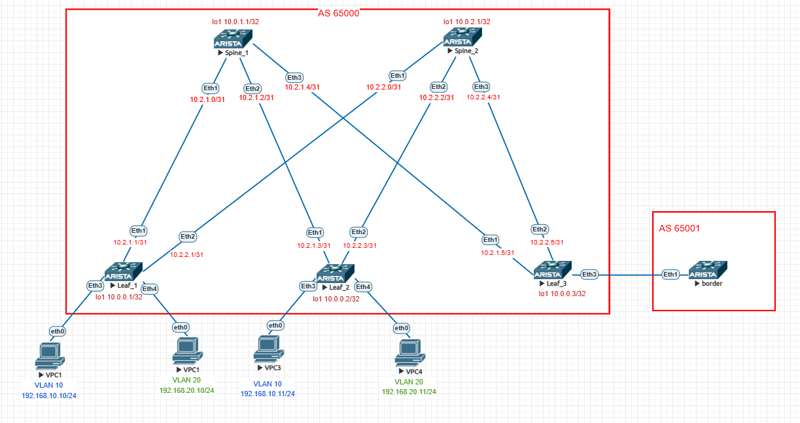

# Overlay. VxLAN EVPN L2

### Цели:
- Настроить BGP peering между Leaf и Spine в AF l2vpn evpn
- Проверить связанность между клиентами

### Адрес план:

|Device|Interface|IP Address|Subnet Mask|Link type
|---|---|---|---|---|
Spine1|lo1|10.0.1.1|255.255.255.255|lo
Spine1 |Eth1|10.2.1.0|255.255.255.254|p2p Spine1 eth1 to Leaf1 eth1
Spine1 |Eth2|10.2.1.2|255.255.255.254|p2p Spine1-eth2 to Leaf2 eth1
Spine1 |Eth3|10.2.1.4|255.255.255.254|p2p Spine1-eth3 to Leaf3-eth1
Spine2 |lo1|10.0.2.1|255.255.255.255|lo
Spine2 |Eth1|10.2.2.0|255.255.255.254|p2p Spine2-eth1 to Leaf1-eth1
Spine2 |Eth2|10.2.2.2|255.255.255.254|p2p Spine2-eth2 to Leaf2-eth2
Spine2 |Eth3|10.2.2.4|255.255.255.254|p2p Spine2-eth3 to Leaf3-eth2
Leaf1 |lo1|10.0.0.1|255.255.255.255|lo
Leaf1 |Eth1|10.2.1.1|255.255.255.254|p2p leaf1-eth1 to Spine1-eth1
Leaf1 |Eth2|10.2.2.1|255.255.255.254|p2p leaf1-eth2 to Spine2-eth1
Leaf2 |lo1|10.0.0.2|255.255.255.255|lo
Leaf2 |Eth1|10.2.1.3|255.255.255.254|p2p leaf2-eth1 to Spine1-eth2
Leaf2 |Eth2|10.2.2.3|255.255.255.254|p2p leaf2-eth2 to Spine2-eth2
Leaf3 |lo1|10.0.0.3|255.255.255.255|lo
Leaf3 |Eth1|10.2.1.5|255.255.255.254|p2p leaf3-eth1 to Spine1-eth3
Leaf3 |Eth2|10.2.2.5|255.255.255.254|p2p leaf3-eth2 to Spine2-eth3
Leaf3 |Eth3.10|10.10.10.0|255.255.255.254|vlan10 leaf3-eth3.10 to border-eth1.10
Leaf3 |Eth3.20|10.10.20.0|255.255.255.254|vlan20 leaf3-eth3.20 to border-eth1.20
Border|Eth1.10|10.10.10.1|255.255.255.254|vlan10 border-eth1.10 to leaf3-eth3.10
Border|Eth1.20|10.10.20.1|255.255.255.254|vlan20 border-eth1.20 to leaf3-eth3.20
VPC1  |Eth0|192.168.10.10|255.255.255.0|VPC1_vlan10-eth0 to Leaf1-eth3
VPC2  |Eth0|192.168.20.10|255.255.255.0|VPC2_vlan20-eth0 to Leaf1-eth4
VPC3  |Eth0|192.168.10.11|255.255.255.0|VPC3_vlan10-eth0 to Leaf2-eth3
VPC4  |Eth0|192.168.20.11|255.255.255.0|VPC4_vlan20-eth0 to Leaf2-eth4

## Выполнение:
### Подготовка оборудования:
- назначаем адреса интерфейсов коммутаторам, согласно адрес плана, переводим интерфейс в L3 режим.
- включаем маршрутизацию
- включаем протокол динамической маршрутизации BGP, назанчаем номер AS
- объявляем в BGP необходимые интерфейсы при помощи карты маршрутов и префикс листаов, анонсируем loopback интерфейс в bgp
- включаем глобальное использование BFD
- Включаем и настраиваем BFD на интерфейсах.
- создаем интерфейс VxVlan 1
- назначаем адреса всем VPC, сошласно адрес-плана
- Объявляем в BGP созданные vlan, указываем route-distinguisher, route-target 
- Настроить пользовательские интерфейсы, добавить их в соответстующие вланы.
- Настроить VRF-ы в контексте BGP, указать route target-ы на импорт и на экспорт, настроить редистрибуцию connected сетей.
- Настроить Leaf3 в качестве пограничного узла, добавить все VRF, настроить BGP соседство в каждом из VRF с пограничным маршутизатоом Border.
- Убедиться в связности между клиентами в разных vrf

 Конфигурация leaf1 

~~~
hostname Leaf1
!
spanning-tree mode mstp
!
vlan 10,20
!
vrf instance Client
!
vrf instance Host
!
interface Ethernet1
   description p2p leaf1-eth1 to Spine1-eth1
   no switchport
   ip address 10.2.1.1/31
   bfd interval 100 min-rx 100 multiplier 3
!
interface Ethernet2
   description p2p leaf1-eth2 to Spine2-eth1
   no switchport
   ip address 10.2.2.1/31
   bfd interval 100 min-rx 100 multiplier 3
!
interface Ethernet3
   description to-pc1
   mtu 9000
   switchport access vlan 10
!
interface Ethernet4
   description to-pc2
   mtu 9000
   switchport access vlan 20
!
interface Ethernet5
!
interface Ethernet6
!
interface Ethernet7
!
interface Ethernet8
!
interface Loopback1
   ip address 10.0.0.1/32
!
interface Management1
!
interface Vlan10
   vrf Host
   ip address virtual 192.168.10.1/24
!
interface Vlan20
   vrf Client
   ip address virtual 192.168.20.1/24
!
interface Vxlan1
   vxlan source-interface Loopback1
   vxlan udp-port 4789
   vxlan vlan 10 vni 10010
   vxlan vlan 20 vni 10020
   vxlan vrf Client vni 10002
   vxlan vrf Host vni 10001
!
ip virtual-router mac-address 00:00:00:00:00:01
!
ip routing
ip routing vrf Client
ip routing vrf Host
!
ip prefix-list PL_POOL
   seq 10 permit 10.0.0.1/32
!
route-map RM_REDIS_CON permit 10
   match ip address prefix-list PL_POOL
!
router bgp 65000
   router-id 10.0.0.1
   maximum-paths 10
   neighbor EVPN peer group
   neighbor EVPN remote-as 65000
   neighbor EVPN update-source Loopback1
   neighbor EVPN send-community extended
   neighbor SPINE peer group
   neighbor SPINE remote-as 65000
   neighbor SPINE timers 3 9
   neighbor 10.0.1.1 peer group EVPN
   neighbor 10.0.2.1 peer group EVPN
   neighbor 10.2.1.0 peer group SPINE
   neighbor 10.2.2.0 peer group SPINE
   redistribute connected
   !
   vlan 10
      rd 10.0.0.1:10010
      route-target both 10:10010
      redistribute learned
   !
   vlan 20
      rd 10.0.0.1:10020
      route-target both 20:10020
      redistribute learned
   !
   address-family evpn
      neighbor EVPN activate
   !
   address-family ipv4
      neighbor SPINE activate
   !
   vrf Client
      rd 10.0.0.1:10002
      route-target import evpn 65000:10002
      route-target export evpn 65000:10002
      redistribute connected
   !
   vrf Host
      rd 10.0.0.1:10001
      route-target import evpn 65000:10001
      route-target export evpn 65000:10001
      redistribute connected
!
end

~~~

 Конфигурация leaf2 

~~~
hostname Leaf2
!
spanning-tree mode mstp
!
vlan 10,20
!
vrf instance Client
!
vrf instance Host
!
interface Ethernet1
   description p2p Leaf2-eth1 to Spine1-eth2
   no switchport
   ip address 10.2.1.3/31
   bfd interval 100 min-rx 100 multiplier 3
!
interface Ethernet2
   description p2p leaf2-eth2 to spine2-eth2
   no switchport
   ip address 10.2.2.3/31
   bfd interval 100 min-rx 100 multiplier 3
!
interface Ethernet3
   description to-pc3
   mtu 9000
   switchport access vlan 10
!
interface Ethernet4
   description to-pc4
   mtu 9000
   switchport access vlan 20
!
interface Ethernet5
!
interface Ethernet6
!
interface Ethernet7
!
interface Ethernet8
!
interface Loopback1
   ip address 10.0.0.2/32
!
interface Management1
!
interface Vlan10
   vrf Host
   ip address virtual 192.168.10.1/24
!
interface Vlan20
   vrf Client
   ip address virtual 192.168.20.1/24
!
interface Vxlan1
   vxlan source-interface Loopback1
   vxlan udp-port 4789
   vxlan vlan 10 vni 10010
   vxlan vlan 20 vni 10020
   vxlan vrf Client vni 10002
   vxlan vrf Host vni 10001
!
ip virtual-router mac-address 00:00:00:00:00:01
!
ip routing
ip routing vrf Client
ip routing vrf Host
!
ip prefix-list PL_POOL
   seq 10 permit 10.0.0.2/32
!
route-map RM_REDIS_CON permit 10
   match ip address prefix-list PL_POOL
!
router bgp 65000
   router-id 10.0.0.2
   maximum-paths 10
   neighbor EVPN peer group
   neighbor EVPN remote-as 65000
   neighbor EVPN update-source Loopback1
   neighbor EVPN send-community extended
   neighbor SPINE peer group
   neighbor SPINE remote-as 65000
   neighbor SPINE bfd
   neighbor SPINE timers 3 9
   neighbor 10.0.1.1 peer group EVPN
   neighbor 10.0.2.1 peer group EVPN
   neighbor 10.2.1.2 peer group SPINE
   neighbor 10.2.2.2 peer group SPINE
   redistribute connected
   !
   vlan 10
      rd 10.0.0.2:10010
      route-target both 10:10010
      redistribute learned
   !
   vlan 20
      rd 10.0.0.2:10020
      route-target both 20:10020
      redistribute learned
   !
   address-family evpn
      neighbor EVPN activate
   !
   address-family ipv4
      neighbor SPINE activate
   !
   vrf Client
      rd 10.0.0.2:10002
      route-target import evpn 65000:10002
      route-target export evpn 65000:10002
      redistribute connected
   !
   vrf Host
      rd 10.0.0.2:10001
      route-target import evpn 65000:10001
      route-target export evpn 65000:10001
      redistribute connected
!
end

~~~

 Конфигурация leaf3 

~~~
hostname Leaf3
!
spanning-tree mode mstp
!
vlan 30
!
vrf instance Client
!
vrf instance Host
!
interface Ethernet1
   description p2p leaf3-eth1 to spine1-eth3
   no switchport
   ip address 10.2.1.5/31
   bfd interval 100 min-rx 100 multiplier 3
!
interface Ethernet2
   description p2p leaf3-eth2 to spine2-eth3
   no switchport
   ip address 10.2.2.5/31
   bfd interval 100 min-rx 100 multiplier 3
!
interface Ethernet3
   description to-border
   mtu 9000
   no switchport
!
interface Ethernet3.10
   encapsulation dot1q vlan 10
   vrf Host
   ip address 10.10.10.0/31
!
interface Ethernet3.20
   encapsulation dot1q vlan 20
   vrf Client
   ip address 10.10.20.0/31
!
interface Ethernet4
   description to-pc6
   mtu 9000
   switchport access vlan 30
!
interface Ethernet5
!
interface Ethernet6
!
interface Ethernet7
!
interface Ethernet8
!
interface Loopback1
   ip address 10.0.0.3/32
!
interface Management1
!
!
interface Vxlan1
   vxlan source-interface Loopback1
   vxlan udp-port 4789
   vxlan vlan 10 vni 10010
   vxlan vlan 20 vni 10020
   vxlan vrf Client vni 10002
   vxlan vrf Host vni 10001
!
ip virtual-router mac-address 00:00:00:00:00:03
!
ip routing
ip routing vrf Client
ip routing vrf Host
!
ip prefix-list PL_POOL
   seq 10 permit 10.0.0.3/32
!
route-map RM_REDIS_CON permit 10
   match ip address prefix-list PL_POOL
!
router bgp 65000
   router-id 10.0.0.3
   maximum-paths 10
   neighbor EVPN peer group
   neighbor EVPN remote-as 65000
   neighbor EVPN update-source Loopback1
   neighbor EVPN send-community extended
   neighbor SPINE peer group
   neighbor SPINE remote-as 65000
   neighbor SPINE timers 3 9
   neighbor 10.0.1.1 peer group EVPN
   neighbor 10.0.2.1 peer group EVPN
   neighbor 10.2.1.4 peer group SPINE
   neighbor 10.2.2.4 peer group SPINE
   redistribute connected
   redistribute bgp leaked
   !
   vlan 10
      rd 10.0.0.3:10010
      route-target both 10:10010
      redistribute learned
   !
   vlan 20
      rd 10.0.0.3:10020
      route-target both 20:10020
      redistribute learned
   !
   address-family evpn
      neighbor EVPN activate
   !
   address-family ipv4
      neighbor SPINE activate
   !
   vrf Client
      rd 10.0.0.3:10002
      route-target import evpn 65000:10002
      route-target export evpn 65000:10002
      neighbor 10.10.20.1 remote-as 65001
   !
   vrf Host
      rd 10.0.0.3:10001
      route-target import evpn 65000:10001
      route-target export evpn 65000:10001
      neighbor 10.10.10.1 remote-as 65001
!
end

~~~

 Конфигурация spine1 

~~~
hostname Spine1
!
spanning-tree mode mstp
!
interface Ethernet1
   description p2p Spine1_eth1 to Leaf1_eth1
   no switchport
   ip address 10.2.1.0/31
   bfd interval 100 min-rx 100 multiplier 3
   no ip ospf neighbor bfd
!
interface Ethernet2
   description p2p Spine1-eth2 to Leaf2-eth1
   no switchport
   ip address 10.2.1.2/31
   bfd interval 100 min-rx 100 multiplier 3
   no ip ospf neighbor bfd
!
interface Ethernet3
   description p2p Spine1-eth3 to Leaf3-eth1
   no switchport
   ip address 10.2.1.4/31
   bfd interval 100 min-rx 100 multiplier 3
   no ip ospf neighbor bfd
!
interface Ethernet4
!
interface Ethernet5
!
interface Ethernet6
!
interface Ethernet7
!
interface Ethernet8
!
interface Loopback1
   ip address 10.0.1.1/32
!
interface Management1
!
ip routing
!
route-map RM_REDIS_CON permit 10
   match interface Loopback1
!
peer-filter EVPN
   10 match as-range 65001-65003 result accept
!
peer-filter LEAF-AS
   10 match as-range 65001-65003 result accept
!
router bgp 65000
   router-id 10.0.1.1
   maximum-paths 10
   bgp listen range 10.0.0.0/24 peer-group EVPN peer-filter EVPN
   bgp listen range 10.2.1.0/24 peer-group LEAF peer-filter LEAF-AS
   neighbor EVPN peer group
   neighbor EVPN next-hop-unchanged
   neighbor EVPN update-source Loopback1
   neighbor EVPN ebgp-multihop 3
   neighbor EVPN send-community extended
   neighbor LEAF peer group
   redistribute connected route-map RM_REDIS_CON
   !
   address-family evpn
      neighbor EVPN activate
   !
   address-family ipv4
      neighbor LEAF activate
!
end

~~~

 Конфигурация spine2 

~~~
hostname Spine2
!
spanning-tree mode mstp
!
interface Ethernet1
   description p2p Spine2-eth1 to Leaf1-eth2
   no switchport
   ip address 10.2.2.0/31
   bfd interval 100 min-rx 100 multiplier 3
!
interface Ethernet2
   description p2p Spine2-eth2 to Leaf2-eth2
   no switchport
   ip address 10.2.2.2/31
   bfd interval 100 min-rx 100 multiplier 3
!
interface Ethernet3
   description p2p Spine2-eth3 to Leaf3-eth2
   no switchport
   ip address 10.2.2.4/31
   bfd interval 100 min-rx 100 multiplier 3
!
interface Ethernet4
!
interface Ethernet5
!
interface Ethernet6
!
interface Ethernet7
!
interface Ethernet8
!
interface Loopback1
   ip address 10.0.2.1/32
!
interface Management1
!
ip routing
!
route-map RM_REDIS_CON permit 10
   match interface Loopback1
!
peer-filter EVPN
   10 match as-range 65001-65003 result accept
!
peer-filter LEAF-AS
   10 match as-range 65001-65003 result accept
!
router bgp 65000
   router-id 10.0.2.1
   maximum-paths 10
   bgp listen range 10.0.0.0/24 peer-group EVPN peer-filter EVPN
   bgp listen range 10.2.2.0/24 peer-group LEAF peer-filter LEAF-AS
   neighbor EVPN peer group
   neighbor EVPN next-hop-unchanged
   neighbor EVPN update-source Loopback1
   neighbor EVPN ebgp-multihop 3
   neighbor EVPN send-community extended
   neighbor LEAF peer group
   redistribute connected route-map RM_REDIS_CON
   !
   address-family evpn
      neighbor EVPN activate
   !
   address-family ipv4
      neighbor LEAF activate
!
end

~~~

 Конфигурация border 

~~~
hostname Border
!
spanning-tree mode mstp
!
interface Ethernet1
   no switchport
!
interface Ethernet1.10
   encapsulation dot1q vlan 10
   ip address 10.10.10.1/31
!
interface Ethernet1.20
   encapsulation dot1q vlan 20
   ip address 10.10.20.1/31
!
interface Ethernet2
!
interface Ethernet3
!
interface Ethernet4
!
interface Ethernet5
!
interface Ethernet6
!
interface Ethernet7
!
interface Ethernet8
!
interface Management1
!
ip routing
!
ip prefix-list Client seq 10 permit 192.168.20.0/24 eq 24
ip prefix-list Host seq 10 permit 192.168.10.0/24 eq 24
!
route-map Client permit 10
   match ip address prefix-list Client
   set as-path match all replacement auto
!
route-map Host permit 10
   match ip address prefix-list Host
   set as-path match all replacement auto
!
router bgp 65001
   neighbor 10.10.10.0 remote-as 65000
   neighbor 10.10.10.0 route-map Host in
   neighbor 10.10.10.0 route-map Host out
   neighbor 10.10.20.0 remote-as 65000
   neighbor 10.10.20.0 route-map Client in
   neighbor 10.10.20.0 route-map Client out
   neighbor 10.10.20.0 default-originate always
!
end

~~~

### Проверка связности устройств:

Leaf1
~~~
Leaf1#sh ip route vrf all

VRF: default
Codes: C - connected, S - static, K - kernel, 
       O - OSPF, IA - OSPF inter area, E1 - OSPF external type 1,
       E2 - OSPF external type 2, N1 - OSPF NSSA external type 1,
       N2 - OSPF NSSA external type2, B - Other BGP Routes,
       B I - iBGP, B E - eBGP, R - RIP, I L1 - IS-IS level 1,
       I L2 - IS-IS level 2, O3 - OSPFv3, A B - BGP Aggregate,
       A O - OSPF Summary, NG - Nexthop Group Static Route,
       V - VXLAN Control Service, M - Martian,
       DH - DHCP client installed default route,
       DP - Dynamic Policy Route, L - VRF Leaked,
       G  - gRIBI, RC - Route Cache Route

Gateway of last resort is not set

 C        10.0.0.1/32 is directly connected, Loopback1
 B I      10.0.0.2/32 [200/0] via 10.2.1.0, Ethernet1
 B I      10.0.0.3/32 [200/0] via 10.2.1.0, Ethernet1
 B I      10.0.1.1/32 [200/0] via 10.2.1.0, Ethernet1
 B I      10.0.2.1/32 [200/0] via 10.2.2.0, Ethernet2
 C        10.2.1.0/31 is directly connected, Ethernet1
 B I      10.2.1.2/31 [200/0] via 10.2.1.0, Ethernet1
 B I      10.2.1.4/31 [200/0] via 10.2.1.0, Ethernet1
 C        10.2.2.0/31 is directly connected, Ethernet2
 B I      10.2.2.2/31 [200/0] via 10.2.1.0, Ethernet1
 B I      10.2.2.4/31 [200/0] via 10.2.1.0, Ethernet1

VRF: Client
Codes: C - connected, S - static, K - kernel, 
       O - OSPF, IA - OSPF inter area, E1 - OSPF external type 1,
       E2 - OSPF external type 2, N1 - OSPF NSSA external type 1,
       N2 - OSPF NSSA external type2, B - Other BGP Routes,
       B I - iBGP, B E - eBGP, R - RIP, I L1 - IS-IS level 1,
       I L2 - IS-IS level 2, O3 - OSPFv3, A B - BGP Aggregate,
       A O - OSPF Summary, NG - Nexthop Group Static Route,
       V - VXLAN Control Service, M - Martian,
       DH - DHCP client installed default route,
       DP - Dynamic Policy Route, L - VRF Leaked,
       G  - gRIBI, RC - Route Cache Route

Gateway of last resort:
 B I      0.0.0.0/0 [200/0] via VTEP 10.0.0.3 VNI 10002 router-mac 50:00:00:15:f4:e8 local-interface Vxlan1

 C        192.168.20.0/24 is directly connected, Vlan20

VRF: Host
Codes: C - connected, S - static, K - kernel, 
       O - OSPF, IA - OSPF inter area, E1 - OSPF external type 1,
       E2 - OSPF external type 2, N1 - OSPF NSSA external type 1,
       N2 - OSPF NSSA external type2, B - Other BGP Routes,
       B I - iBGP, B E - eBGP, R - RIP, I L1 - IS-IS level 1,
       I L2 - IS-IS level 2, O3 - OSPFv3, A B - BGP Aggregate,
       A O - OSPF Summary, NG - Nexthop Group Static Route,
       V - VXLAN Control Service, M - Martian,
       DH - DHCP client installed default route,
       DP - Dynamic Policy Route, L - VRF Leaked,
       G  - gRIBI, RC - Route Cache Route

Gateway of last resort is not set

 B I      192.168.10.11/32 [200/0] via VTEP 10.0.0.2 VNI 10001 router-mac 50:00:00:03:37:66 local-interface Vxlan1
 C        192.168.10.0/24 is directly connected, Vlan10

Leaf1#show bgp evpn route-type ip-prefix ipv4
BGP routing table information for VRF default
Router identifier 10.0.0.1, local AS number 65000
Route status codes: * - valid, > - active, S - Stale, E - ECMP head, e - ECMP
                    c - Contributing to ECMP, % - Pending BGP convergence
Origin codes: i - IGP, e - EGP, ? - incomplete
AS Path Attributes: Or-ID - Originator ID, C-LST - Cluster List, LL Nexthop - Link Local Nexthop

          Network                Next Hop              Metric  LocPref Weight  Path
 * >      RD: 10.0.0.3:10002 ip-prefix 0.0.0.0/0
                                 10.0.0.3              -       100     0       65001 ? Or-ID: 10.0.0.3 C-LST: 10.0.1.1 
 * >      RD: 10.0.0.1:10001 ip-prefix 192.168.10.0/24
                                 -                     -       -       0       i
 * >      RD: 10.0.0.2:10001 ip-prefix 192.168.10.0/24
                                 10.0.0.2              -       100     0       i Or-ID: 10.0.0.2 C-LST: 10.0.1.1 
 * >      RD: 10.0.0.1:10002 ip-prefix 192.168.20.0/24
                                 -                     -       -       0       i
 * >      RD: 10.0.0.2:10002 ip-prefix 192.168.20.0/24
                                 10.0.0.2              -       100     0       i Or-ID: 10.0.0.2 C-LST: 10.0.1.1 

~~~
Leaf2
~~~
Leaf2#sh ip route vrf all

VRF: default
Codes: C - connected, S - static, K - kernel, 
       O - OSPF, IA - OSPF inter area, E1 - OSPF external type 1,
       E2 - OSPF external type 2, N1 - OSPF NSSA external type 1,
       N2 - OSPF NSSA external type2, B - Other BGP Routes,
       B I - iBGP, B E - eBGP, R - RIP, I L1 - IS-IS level 1,
       I L2 - IS-IS level 2, O3 - OSPFv3, A B - BGP Aggregate,
       A O - OSPF Summary, NG - Nexthop Group Static Route,
       V - VXLAN Control Service, M - Martian,
       DH - DHCP client installed default route,
       DP - Dynamic Policy Route, L - VRF Leaked,
       G  - gRIBI, RC - Route Cache Route

Gateway of last resort is not set

 B I      10.0.0.1/32 [200/0] via 10.2.1.2, Ethernet1
 C        10.0.0.2/32 is directly connected, Loopback1
 B I      10.0.0.3/32 [200/0] via 10.2.1.2, Ethernet1
 B I      10.0.1.1/32 [200/0] via 10.2.1.2, Ethernet1
 B I      10.0.2.1/32 [200/0] via 10.2.2.2, Ethernet2
 B I      10.2.1.0/31 [200/0] via 10.2.1.2, Ethernet1
 C        10.2.1.2/31 is directly connected, Ethernet1
 B I      10.2.1.4/31 [200/0] via 10.2.1.2, Ethernet1
 B I      10.2.2.0/31 [200/0] via 10.2.1.2, Ethernet1
 C        10.2.2.2/31 is directly connected, Ethernet2
 B I      10.2.2.4/31 [200/0] via 10.2.1.2, Ethernet1

VRF: Client
Codes: C - connected, S - static, K - kernel, 
       O - OSPF, IA - OSPF inter area, E1 - OSPF external type 1,
       E2 - OSPF external type 2, N1 - OSPF NSSA external type 1,
       N2 - OSPF NSSA external type2, B - Other BGP Routes,
       B I - iBGP, B E - eBGP, R - RIP, I L1 - IS-IS level 1,
       I L2 - IS-IS level 2, O3 - OSPFv3, A B - BGP Aggregate,
       A O - OSPF Summary, NG - Nexthop Group Static Route,
       V - VXLAN Control Service, M - Martian,
       DH - DHCP client installed default route,
       DP - Dynamic Policy Route, L - VRF Leaked,
       G  - gRIBI, RC - Route Cache Route

Gateway of last resort:
 B I      0.0.0.0/0 [200/0] via VTEP 10.0.0.3 VNI 10002 router-mac 50:00:00:15:f4:e8 local-interface Vxlan1

 B I      192.168.20.10/32 [200/0] via VTEP 10.0.0.1 VNI 10002 router-mac 50:00:00:d5:5d:c0 local-interface Vxlan1
 C        192.168.20.0/24 is directly connected, Vlan20

VRF: Host
Codes: C - connected, S - static, K - kernel, 
       O - OSPF, IA - OSPF inter area, E1 - OSPF external type 1,
       E2 - OSPF external type 2, N1 - OSPF NSSA external type 1,
       N2 - OSPF NSSA external type2, B - Other BGP Routes,
       B I - iBGP, B E - eBGP, R - RIP, I L1 - IS-IS level 1,
       I L2 - IS-IS level 2, O3 - OSPFv3, A B - BGP Aggregate,
       A O - OSPF Summary, NG - Nexthop Group Static Route,
       V - VXLAN Control Service, M - Martian,
       DH - DHCP client installed default route,
       DP - Dynamic Policy Route, L - VRF Leaked,
       G  - gRIBI, RC - Route Cache Route

Gateway of last resort is not set

 B I      192.168.10.10/32 [200/0] via VTEP 10.0.0.1 VNI 10001 router-mac 50:00:00:d5:5d:c0 local-interface Vxlan1
 C        192.168.10.0/24 is directly connected, Vlan10

Leaf2#sh bgp evpn route-type ip-prefix ipv4
BGP routing table information for VRF default
Router identifier 10.0.0.2, local AS number 65000
Route status codes: * - valid, > - active, S - Stale, E - ECMP head, e - ECMP
                    c - Contributing to ECMP, % - Pending BGP convergence
Origin codes: i - IGP, e - EGP, ? - incomplete
AS Path Attributes: Or-ID - Originator ID, C-LST - Cluster List, LL Nexthop - Link Local Nexthop

          Network                Next Hop              Metric  LocPref Weight  Path
 * >      RD: 10.0.0.3:10002 ip-prefix 0.0.0.0/0
                                 10.0.0.3              -       100     0       65001 ? Or-ID: 10.0.0.3 C-LST: 10.0.1.1 
 * >      RD: 10.0.0.1:10001 ip-prefix 192.168.10.0/24
                                 10.0.0.1              -       100     0       i Or-ID: 10.0.0.1 C-LST: 10.0.1.1 
 * >      RD: 10.0.0.2:10001 ip-prefix 192.168.10.0/24
                                 -                     -       -       0       i
 * >      RD: 10.0.0.1:10002 ip-prefix 192.168.20.0/24
                                 10.0.0.1              -       100     0       i Or-ID: 10.0.0.1 C-LST: 10.0.1.1 
 * >      RD: 10.0.0.2:10002 ip-prefix 192.168.20.0/24
                                 -                     -       -       0       i

~~~
Leaf3
~~~
Leaf3#sh ip route vrf all bgp 

VRF: default
Codes: C - connected, S - static, K - kernel, 
       O - OSPF, IA - OSPF inter area, E1 - OSPF external type 1,
       E2 - OSPF external type 2, N1 - OSPF NSSA external type 1,
       N2 - OSPF NSSA external type2, B - Other BGP Routes,
       B I - iBGP, B E - eBGP, R - RIP, I L1 - IS-IS level 1,
       I L2 - IS-IS level 2, O3 - OSPFv3, A B - BGP Aggregate,
       A O - OSPF Summary, NG - Nexthop Group Static Route,
       V - VXLAN Control Service, M - Martian,
       DH - DHCP client installed default route,
       DP - Dynamic Policy Route, L - VRF Leaked,
       G  - gRIBI, RC - Route Cache Route

 B I      10.0.0.1/32 [200/0] via 10.2.1.4, Ethernet1
 B I      10.0.0.2/32 [200/0] via 10.2.1.4, Ethernet1
 B I      10.0.1.1/32 [200/0] via 10.2.1.4, Ethernet1
 B I      10.0.2.1/32 [200/0] via 10.2.2.4, Ethernet2
 B I      10.2.1.0/31 [200/0] via 10.2.1.4, Ethernet1
 B I      10.2.1.2/31 [200/0] via 10.2.1.4, Ethernet1
 B I      10.2.2.0/31 [200/0] via 10.2.1.4, Ethernet1
 B I      10.2.2.2/31 [200/0] via 10.2.1.4, Ethernet1

VRF: Client
Codes: C - connected, S - static, K - kernel, 
       O - OSPF, IA - OSPF inter area, E1 - OSPF external type 1,
       E2 - OSPF external type 2, N1 - OSPF NSSA external type 1,
       N2 - OSPF NSSA external type2, B - Other BGP Routes,
       B I - iBGP, B E - eBGP, R - RIP, I L1 - IS-IS level 1,
       I L2 - IS-IS level 2, O3 - OSPFv3, A B - BGP Aggregate,
       A O - OSPF Summary, NG - Nexthop Group Static Route,
       V - VXLAN Control Service, M - Martian,
       DH - DHCP client installed default route,
       DP - Dynamic Policy Route, L - VRF Leaked,
       G  - gRIBI, RC - Route Cache Route

Gateway of last resort:
 B E      0.0.0.0/0 [200/0] via 10.10.20.1, Ethernet3.20

 B I      192.168.20.10/32 [200/0] via VTEP 10.0.0.1 VNI 10002 router-mac 50:00:00:d5:5d:c0 local-interface Vxlan1
 B I      192.168.20.0/24 [200/0] via VTEP 10.0.0.2 VNI 10002 router-mac 50:00:00:03:37:66 local-interface Vxlan1
                                  via VTEP 10.0.0.1 VNI 10002 router-mac 50:00:00:d5:5d:c0 local-interface Vxlan1

VRF: Host
Codes: C - connected, S - static, K - kernel, 
       O - OSPF, IA - OSPF inter area, E1 - OSPF external type 1,
       E2 - OSPF external type 2, N1 - OSPF NSSA external type 1,
       N2 - OSPF NSSA external type2, B - Other BGP Routes,
       B I - iBGP, B E - eBGP, R - RIP, I L1 - IS-IS level 1,
       I L2 - IS-IS level 2, O3 - OSPFv3, A B - BGP Aggregate,
       A O - OSPF Summary, NG - Nexthop Group Static Route,
       V - VXLAN Control Service, M - Martian,
       DH - DHCP client installed default route,
       DP - Dynamic Policy Route, L - VRF Leaked,
       G  - gRIBI, RC - Route Cache Route

 B I      192.168.10.10/32 [200/0] via VTEP 10.0.0.1 VNI 10001 router-mac 50:00:00:d5:5d:c0 local-interface Vxlan1
 B I      192.168.10.11/32 [200/0] via VTEP 10.0.0.2 VNI 10001 router-mac 50:00:00:03:37:66 local-interface Vxlan1
 B I      192.168.10.0/24 [200/0] via VTEP 10.0.0.2 VNI 10001 router-mac 50:00:00:03:37:66 local-interface Vxlan1
                                  via VTEP 10.0.0.1 VNI 10001 router-mac 50:00:00:d5:5d:c0 local-interface Vxlan1

Leaf3#sh ip bgp vrf all
BGP routing table information for VRF default
Router identifier 10.0.0.3, local AS number 65000
Route status codes: s - suppressed contributor, * - valid, > - active, E - ECMP head, e - ECMP
                    S - Stale, c - Contributing to ECMP, b - backup, L - labeled-unicast
                    % - Pending BGP convergence
Origin codes: i - IGP, e - EGP, ? - incomplete
RPKI Origin Validation codes: V - valid, I - invalid, U - unknown
AS Path Attributes: Or-ID - Originator ID, C-LST - Cluster List, LL Nexthop - Link Local Nexthop

          Network                Next Hop              Metric  AIGP       LocPref Weight  Path
 * >      10.0.0.1/32            10.2.1.4              0       -          100     0       i Or-ID: 10.0.0.1 C-LST: 10.0.1.1 
 *        10.0.0.1/32            10.2.1.1              0       -          100     0       i Or-ID: 10.0.0.1 C-LST: 10.0.1.1 
 * >      10.0.0.2/32            10.2.1.4              0       -          100     0       i Or-ID: 10.0.0.2 C-LST: 10.0.1.1 
 *        10.0.0.2/32            10.2.1.3              0       -          100     0       i Or-ID: 10.0.0.2 C-LST: 10.0.1.1 
 * >      10.0.0.3/32            -                     -       -          -       0       i
 * >      10.0.1.1/32            10.2.1.4              0       -          100     0       i
 *        10.0.1.1/32            10.0.1.1              0       -          100     0       i
 * >      10.0.2.1/32            10.2.2.4              0       -          100     0       i
 *        10.0.2.1/32            10.0.2.1              0       -          100     0       i
 * >      10.2.1.0/31            10.2.1.4              0       -          100     0       i Or-ID: 10.0.0.1 C-LST: 10.0.1.1 
 *        10.2.1.0/31            10.2.1.1              0       -          100     0       i Or-ID: 10.0.0.1 C-LST: 10.0.1.1 
 * >      10.2.1.2/31            10.2.1.4              0       -          100     0       i Or-ID: 10.0.0.2 C-LST: 10.0.1.1 
 *        10.2.1.2/31            10.2.1.3              0       -          100     0       i Or-ID: 10.0.0.2 C-LST: 10.0.1.1 
 * >      10.2.1.4/31            -                     -       -          -       0       i
 * >      10.2.2.0/31            10.2.1.4              0       -          100     0       i Or-ID: 10.0.0.1 C-LST: 10.0.1.1 
 *        10.2.2.0/31            10.2.1.1              0       -          100     0       i Or-ID: 10.0.0.1 C-LST: 10.0.1.1 
 * >      10.2.2.2/31            10.2.1.4              0       -          100     0       i Or-ID: 10.0.0.2 C-LST: 10.0.1.1 
 *        10.2.2.2/31            10.2.1.3              0       -          100     0       i Or-ID: 10.0.0.2 C-LST: 10.0.1.1 
 * >      10.2.2.4/31            -                     -       -          -       0       i
BGP routing table information for VRF Client
Router identifier 10.10.20.0, local AS number 65000
Route status codes: s - suppressed contributor, * - valid, > - active, E - ECMP head, e - ECMP
                    S - Stale, c - Contributing to ECMP, b - backup, L - labeled-unicast
                    % - Pending BGP convergence
Origin codes: i - IGP, e - EGP, ? - incomplete
RPKI Origin Validation codes: V - valid, I - invalid, U - unknown
AS Path Attributes: Or-ID - Originator ID, C-LST - Cluster List, LL Nexthop - Link Local Nexthop

          Network                Next Hop              Metric  AIGP       LocPref Weight  Path
 * >      0.0.0.0/0              10.10.20.1            0       -          100     0       65001 ?
 * >Ec    192.168.20.0/24        10.0.0.1              0       -          100     0       i Or-ID: 10.0.0.1 C-LST: 10.0.1.1 
 *  ec    192.168.20.0/24        10.0.0.2              0       -          100     0       i Or-ID: 10.0.0.2 C-LST: 10.0.1.1 
 * >      192.168.20.10/32       10.0.0.1              0       -          100     0       i Or-ID: 10.0.0.1 C-LST: 10.0.1.1 
BGP routing table information for VRF Host
Router identifier 10.10.10.0, local AS number 65000
Route status codes: s - suppressed contributor, * - valid, > - active, E - ECMP head, e - ECMP
                    S - Stale, c - Contributing to ECMP, b - backup, L - labeled-unicast
                    % - Pending BGP convergence
Origin codes: i - IGP, e - EGP, ? - incomplete
RPKI Origin Validation codes: V - valid, I - invalid, U - unknown
AS Path Attributes: Or-ID - Originator ID, C-LST - Cluster List, LL Nexthop - Link Local Nexthop

          Network                Next Hop              Metric  AIGP       LocPref Weight  Path
 * >Ec    192.168.10.0/24        10.0.0.2              0       -          100     0       i Or-ID: 10.0.0.2 C-LST: 10.0.1.1 
 *  ec    192.168.10.0/24        10.0.0.1              0       -          100     0       i Or-ID: 10.0.0.1 C-LST: 10.0.1.1 
 * >      192.168.10.10/32       10.0.0.1              0       -          100     0       i Or-ID: 10.0.0.1 C-LST: 10.0.1.1 
 * >      192.168.10.11/32       10.0.0.2              0       -          100     0       i Or-ID: 10.0.0.2 C-LST: 10.0.1.1 

Leaf3#sh ip bgp summary vrf all
BGP summary information for VRF default
Router identifier 10.0.0.3, local AS number 65000
Neighbor Status Codes: m - Under maintenance
  Neighbor V AS           MsgRcvd   MsgSent  InQ OutQ  Up/Down State   PfxRcd PfxAcc
  10.0.1.1 4 65000             48        31    0    0 00:18:44 Estab   7      7
  10.0.2.1 4 65000             28        31    0    0 00:18:42 Estab   1      1
  10.2.1.4 4 65000            447       446    0    0 00:18:45 Estab   7      7
  10.2.2.4 4 65000            443       440    0    0 00:18:44 Estab   1      1

BGP summary information for VRF Client
Router identifier 10.10.20.0, local AS number 65000
Neighbor Status Codes: m - Under maintenance
  Neighbor   V AS           MsgRcvd   MsgSent  InQ OutQ  Up/Down State   PfxRcd PfxAcc
  10.10.20.1 4 65001             29        35    0    0 00:24:25 Estab   1      1

BGP summary information for VRF Host
Router identifier 10.10.10.0, local AS number 65000
Neighbor Status Codes: m - Under maintenance
  Neighbor   V AS           MsgRcvd   MsgSent  InQ OutQ  Up/Down State   PfxRcd PfxAcc
  10.10.10.1 4 65001             28        35    0    0 00:24:23 Estab   0      0

~~~

проверка того что default маршрут прилетел в сторону клиента:

~~~
VPCS> show ip

NAME        : VPCS[1]
IP/MASK     : 192.168.20.10/24
GATEWAY     : 192.168.20.1
DNS         : 
MAC         : 00:50:79:66:68:07
LPORT       : 20000
RHOST:PORT  : 127.0.0.1:30000
MTU         : 1500

VPCS> trace 77.88.8.8
trace to 77.88.8.8, 8 hops max, press Ctrl+C to stop
 1   192.168.20.1   8.606 ms  6.962 ms  6.372 ms
 2   10.10.20.0   31.692 ms  31.792 ms  28.714 ms
 3   *10.10.20.1   61.241 ms (ICMP type:3, code:0, Destination network unreachable)  *
~~~

Не могу разобраться почему не работает ping межжду клиентами в разных vrf через border. ibgp и ebgp сесии поднялись. 