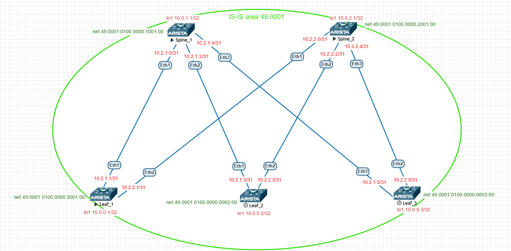

# Underlay. IS-IS

### Цели:
- Настроить протокол IS-IS для Underlay сети
- Проверить связанность между устройствами

=
### Адрес план:

|Device|Interface|IP Address|Subnet Mask|Link type
|---|---|---|---|---|
Spine1|lo1|10.0.1.1|255.255.255.255|lo
Spine1 |Eth1|10.2.1.0|255.255.255.254|p2p Spine1 eth1 to Leaf1 eth1
Spine1 |Eth2|10.2.1.2|255.255.255.254|p2p Spine1-eth2 to Leaf2 eth1
Spine1 |Eth3|10.2.1.4|255.255.255.254|p2p Spine1-eth3 to Leaf3-eth1
Spine2 |lo1|10.0.2.1|255.255.255.255|lo
Spine2 |Eth1|10.2.2.0|255.255.255.254|p2p Spine2-eth1 to Leaf1-eth1
Spine2 |Eth2|10.2.2.2|255.255.255.254|p2p Spine2-eth2 to Leaf2-eth2
Spine2 |Eth3|10.2.2.4|255.255.255.254|p2p Spine2-eth3 to Leaf3-eth2
Leaf1 |lo1|10.0.0.1|255.255.255.255|lo
Leaf1 |Eth1|10.2.1.1|255.255.255.254|p2p leaf1-eth1 to Spine1-eth1
Leaf1 |Eth2|10.2.2.1|255.255.255.254|p2p leaf1-eth2 to Spine2-eth1
Leaf2 |lo1|10.0.0.2|255.255.255.255|lo
Leaf2 |Eth1|10.2.1.3|255.255.255.254|p2p leaf2-eth1 to Spine1-eth2
Leaf2 |Eth2|10.2.2.3|255.255.255.254|p2p leaf2-eth2 to Spine2-eth2
Leaf3 |lo1|10.0.0.3|255.255.255.255|lo
Leaf3 |Eth1|10.2.1.5|255.255.255.254|p2p leaf3-eth1 to Spine1-eth3
Leaf3 |Eth2|10.2.2.5|255.255.255.254|p2p leaf3-eth2 to Spine2-eth3
## Выполнение:
### Подготовка оборудования:
- назначаем адреса интерфейсов коммутаторам, согласно адрес плана, переводим интерфейс в L3 режим.
- включаем маршрутизацию
- включаем протокол динамической маршрутизации is-is, назанчаем номер NET
- Включаем Passive-interface default, добавляем используемые интерфейсы "no paasive"и используем режим point-to-point
- включаем глобальное использование BFD
- активируем протокол is-is на используемых интерфейсах, назначаем пароль, и активируем режиим point-to-point
- Включаем и настраиваем BFD на интерфейсах.

 Конфигурация leaf1 

~~~
hostname Leaf1
!
spanning-tree mode mstp
!
interface Ethernet1
   description p2p leaf1-eth1 to Spine1-eth1
   no switchport
   ip address 10.2.1.1/31
   bfd interval 50 min-rx 50 multiplier 4
   no ip ospf neighbor bfd
   isis enable underlay
   isis circuit-type level-1
   isis network point-to-point
   isis authentication mode md5 level-1
   isis authentication key 7 PlLVjrzKTdiNkcjzYCQF7g== level-1
   isis authentication key 7 tQIVPYCu8o6YgmhxDYNyUA== level-2
!
interface Ethernet2
   description p2p leaf1-eth2 to Spine2-eth1
   no switchport
   ip address 10.2.2.1/31
   bfd interval 50 min-rx 50 multiplier 4
   no ip ospf neighbor bfd
   isis enable underlay
   isis circuit-type level-1
   isis network point-to-point
   isis authentication mode md5 level-1
   isis authentication key 7 PlLVjrzKTdiNkcjzYCQF7g== level-1
   isis authentication key 7 tQIVPYCu8o6YgmhxDYNyUA== level-2
!
interface Ethernet3
!
interface Ethernet4
!
interface Ethernet5
!
interface Ethernet6
!
interface Ethernet7
!
interface Ethernet8
!
interface Loopback1
   ip address 10.0.0.1/32
   ip ospf area 0.0.0.0
   isis enable underlay
!
interface Management1
!
ip routing
!
router isis underlay
   net 49.0001.0100.0000.0001.00
   is-hostname Leaf1
   is-type level-1
   log-adjacency-changes
   !
   address-family ipv4 unicast
!
end
~~~

 Конфигурация leaf2 

~~~
hostname Leaf2
!
spanning-tree mode mstp
!
interface Ethernet1
   description p2p Leaf2-eth1 to Spine1-eth2
   no switchport
   ip address 10.2.1.3/31
   bfd interval 50 min-rx 50 multiplier 4
   isis enable underlay
   isis circuit-type level-1
   isis network point-to-point
   isis authentication mode md5 level-1
   isis authentication key 7 PlLVjrzKTdiNkcjzYCQF7g== level-1
   isis authentication key 7 tQIVPYCu8o6YgmhxDYNyUA== level-2
!
interface Ethernet2
   description p2p leaf2-eth2 to spine2-eth2
   no switchport
   ip address 10.2.2.3/31
   bfd interval 50 min-rx 50 multiplier 4
   isis enable underlay
   isis circuit-type level-1
   isis network point-to-point
   isis authentication mode md5 level-1
   isis authentication key 7 PlLVjrzKTdiNkcjzYCQF7g== level-1
   isis authentication key 7 tQIVPYCu8o6YgmhxDYNyUA== level-2
!
interface Ethernet3
!
interface Ethernet4
!
interface Ethernet5
!
interface Ethernet6
!
interface Ethernet7
!
interface Ethernet8
!
interface Loopback1
   ip address 10.0.0.2/32
   ip ospf area 0.0.0.0
   isis enable underlay
!
interface Management1
!
ip routing
!
router isis underlay
   net 49.0001.0100.0000.0002.00
   is-hostname Leaf2
   is-type level-1
   log-adjacency-changes
   !
   address-family ipv4 unicast
!
end
~~~

 Конфигурация leaf3 

~~~
hostname Leaf3
!
spanning-tree mode mstp
!
interface Ethernet1
   description p2p leaf3-eth1 to spine1-eth3
   no switchport
   ip address 10.2.1.5/31
   bfd interval 50 min-rx 50 multiplier 4
   isis enable underlay
   isis circuit-type level-1
   isis network point-to-point
   isis authentication mode md5 level-1
   isis authentication key 7 PlLVjrzKTdiNkcjzYCQF7g== level-1
   isis authentication key 7 tQIVPYCu8o6YgmhxDYNyUA== level-2
!
interface Ethernet2
   description p2p leaf3-eth2 to spine2-eth3
   no switchport
   ip address 10.2.2.5/31
   bfd interval 50 min-rx 50 multiplier 4
   isis enable underlay
   isis circuit-type level-1
   isis network point-to-point
   isis authentication mode md5 level-1
   isis authentication key 7 PlLVjrzKTdiNkcjzYCQF7g== level-1
   isis authentication key 7 tQIVPYCu8o6YgmhxDYNyUA== level-2
!
interface Ethernet3
!
interface Ethernet4
!
interface Ethernet5
!
interface Ethernet6
!
interface Ethernet7
!
interface Ethernet8
!
interface Loopback1
   ip address 10.0.0.3/32
   ip ospf area 0.0.0.0
   isis enable underlay
!
interface Management1
!
ip routing
!
router isis underlay
   net 49.0001.0100.0000.0003.00
   is-hostname Leaf3
   is-type level-1
   log-adjacency-changes
   !
   address-family ipv4 unicast
!
end
~~~

 Конфигурация spine1 

~~~
hostname Spine1
!
spanning-tree mode mstp
!
interface Ethernet1
   description p2p Spine1_eth1 to Leaf1_eth1
   no switchport
   ip address 10.2.1.0/31
   bfd interval 50 min-rx 50 multiplier 4
   no ip ospf neighbor bfd
   isis enable underlay
   isis circuit-type level-1
   isis network point-to-point
   isis authentication mode md5 level-1
   isis authentication key 7 PlLVjrzKTdiNkcjzYCQF7g== level-1
   isis authentication key 7 tQIVPYCu8o6YgmhxDYNyUA== level-2
!
interface Ethernet2
   description p2p Spine1-eth2 to Leaf2-eth1
   no switchport
   ip address 10.2.1.2/31
   bfd interval 50 min-rx 50 multiplier 4
   no ip ospf neighbor bfd
   isis enable underlay
   isis circuit-type level-1
   isis network point-to-point
   isis authentication mode md5 level-1
   isis authentication key 7 PlLVjrzKTdiNkcjzYCQF7g== level-1
   isis authentication key 7 tQIVPYCu8o6YgmhxDYNyUA== level-2
!
interface Ethernet3
   description p2p Spine1-eth3 to Leaf3-eth1
   no switchport
   ip address 10.2.1.4/31
   bfd interval 50 min-rx 50 multiplier 4
   no ip ospf neighbor bfd
   isis enable underlay
   isis circuit-type level-1
   isis network point-to-point
   isis authentication mode md5 level-1
   isis authentication key 7 PlLVjrzKTdiNkcjzYCQF7g== level-1
   isis authentication key 7 tQIVPYCu8o6YgmhxDYNyUA== level-2
!
interface Ethernet4
!
interface Ethernet5
!
interface Ethernet6
!
interface Ethernet7
!
interface Ethernet8
!
interface Loopback1
   ip address 10.0.1.1/32
   isis enable underlay
!
interface Management1
!
ip routing
!
router isis underlay
   net 49.0001.0100.0000.1001.00
   is-hostname Spine1
   is-type level-1
   log-adjacency-changes
   !
   address-family ipv4 unicast
!
end
~~~

 Конфигурация spine2 

~~~
hostname Spine2
!
spanning-tree mode mstp
!
interface Ethernet1
   description p2p Spine2-eth1 to Leaf1-eth2
   no switchport
   ip address 10.2.2.0/31
   bfd interval 50 min-rx 50 multiplier 4
   no ip ospf neighbor bfd
   isis enable underlay
   isis circuit-type level-1
   isis network point-to-point
   isis authentication mode md5 level-1
   isis authentication key 7 PlLVjrzKTdiNkcjzYCQF7g== level-1
   isis authentication key 7 tQIVPYCu8o6YgmhxDYNyUA== level-2
!
interface Ethernet2
   description p2p Spine2-eth2 to Leaf2-eth2
   no switchport
   ip address 10.2.2.2/31
   bfd interval 50 min-rx 50 multiplier 4
   no ip ospf neighbor bfd
   isis enable underlay
   isis circuit-type level-1
   isis network point-to-point
   isis authentication mode md5 level-1
   isis authentication key 7 PlLVjrzKTdiNkcjzYCQF7g== level-1
   isis authentication key 7 tQIVPYCu8o6YgmhxDYNyUA== level-2
!
interface Ethernet3
   description p2p Spine2-eth3 to Leaf3-eth2
   no switchport
   ip address 10.2.2.4/31
   bfd interval 50 min-rx 50 multiplier 4
   ip ospf neighbor bfd
   ip ospf network point-to-point
   ip ospf area 0.0.0.0
   isis enable underlay
   isis circuit-type level-1
   isis network point-to-point
   isis authentication mode md5 level-1
   isis authentication key 7 PlLVjrzKTdiNkcjzYCQF7g== level-1
   isis authentication key 7 tQIVPYCu8o6YgmhxDYNyUA== level-2
!
interface Ethernet4
!
interface Ethernet5
!
interface Ethernet6
!
interface Ethernet7
!
interface Ethernet8
!
interface Loopback1
   ip address 10.0.2.1/32
   isis enable underlay
!
interface Management1
!
ip routing
!
router isis underlay
   net 49.0001.0100.0000.2001.00
   is-hostname Spine2
   is-type level-1
   log-adjacency-changes
   !
   address-family ipv4 unicast
!
end
~~~

### Проверка связности устройств:
Leaf1
~~~
Leaf1#  show ip route isis

VRF: default
Codes: C - connected, S - static, K - kernel, 
       O - OSPF, IA - OSPF inter area, E1 - OSPF external type 1,
       E2 - OSPF external type 2, N1 - OSPF NSSA external type 1,
       N2 - OSPF NSSA external type2, B - Other BGP Routes,
       B I - iBGP, B E - eBGP, R - RIP, I L1 - IS-IS level 1,
       I L2 - IS-IS level 2, O3 - OSPFv3, A B - BGP Aggregate,
       A O - OSPF Summary, NG - Nexthop Group Static Route,
       V - VXLAN Control Service, M - Martian,
       DH - DHCP client installed default route,
       DP - Dynamic Policy Route, L - VRF Leaked,
       G  - gRIBI, RC - Route Cache Route

 I L1     10.0.0.2/32 [115/30] via 10.2.1.0, Ethernet1
                               via 10.2.2.0, Ethernet2
 I L1     10.0.0.3/32 [115/30] via 10.2.1.0, Ethernet1
                               via 10.2.2.0, Ethernet2
 I L1     10.0.1.1/32 [115/20] via 10.2.1.0, Ethernet1
 I L1     10.0.2.1/32 [115/20] via 10.2.2.0, Ethernet2
 I L1     10.2.1.2/31 [115/20] via 10.2.1.0, Ethernet1
 I L1     10.2.1.4/31 [115/20] via 10.2.1.0, Ethernet1
 I L1     10.2.2.2/31 [115/20] via 10.2.2.0, Ethernet2
 I L1     10.2.2.4/31 [115/20] via 10.2.2.0, Ethernet2

Leaf1#show isis neighbors
 
Instance  VRF      System Id        Type Interface          SNPA              State Hold time   Circuit Id          
underlay  default  Spine1           L1   Ethernet1          P2P               UP    29          0E                  
underlay  default  Spine2           L1   Ethernet2          P2P               UP    22          0E                  
Leaf1#show isis database level-1

IS-IS Instance: underlay VRF: default
  IS-IS Level 1 Link State Database
    LSPID                   Seq Num  Cksum  Life Length IS Flags
    Leaf1.00-00                  82  46217   816    121 L1 <>
    Leaf2.00-00                  82   4894   799    121 L1 <>
    Leaf3.00-00                  80  36248   371    121 L1 <>
    Spine1.00-00                 83  34775   773    146 L1 <>
    Spine2.00-00                 83   4659  1070    146 L1 <>

~~~
Leaf2
~~~
Leaf2#show ip route isis

VRF: default
Codes: C - connected, S - static, K - kernel, 
       O - OSPF, IA - OSPF inter area, E1 - OSPF external type 1,
       E2 - OSPF external type 2, N1 - OSPF NSSA external type 1,
       N2 - OSPF NSSA external type2, B - Other BGP Routes,
       B I - iBGP, B E - eBGP, R - RIP, I L1 - IS-IS level 1,
       I L2 - IS-IS level 2, O3 - OSPFv3, A B - BGP Aggregate,
       A O - OSPF Summary, NG - Nexthop Group Static Route,
       V - VXLAN Control Service, M - Martian,
       DH - DHCP client installed default route,
       DP - Dynamic Policy Route, L - VRF Leaked,
       G  - gRIBI, RC - Route Cache Route

 I L1     10.0.0.1/32 [115/30] via 10.2.1.2, Ethernet1
                               via 10.2.2.2, Ethernet2
 I L1     10.0.0.3/32 [115/30] via 10.2.1.2, Ethernet1
                               via 10.2.2.2, Ethernet2
 I L1     10.0.1.1/32 [115/20] via 10.2.1.2, Ethernet1
 I L1     10.0.2.1/32 [115/20] via 10.2.2.2, Ethernet2
 I L1     10.2.1.0/31 [115/20] via 10.2.1.2, Ethernet1
 I L1     10.2.1.4/31 [115/20] via 10.2.1.2, Ethernet1
 I L1     10.2.2.0/31 [115/20] via 10.2.2.2, Ethernet2
 I L1     10.2.2.4/31 [115/20] via 10.2.2.2, Ethernet2

Leaf2#show isis neighbors
 
Instance  VRF      System Id        Type Interface          SNPA              State Hold time   Circuit Id          
underlay  default  Spine1           L1   Ethernet1          P2P               UP    24          0F                  
underlay  default  Spine2           L1   Ethernet2          P2P               UP    26          0F                  
Leaf2#show isis database

IS-IS Instance: underlay VRF: default
  IS-IS Level 1 Link State Database
    LSPID                   Seq Num  Cksum  Life Length IS Flags
    Leaf1.00-00                  82  46217   528    121 L1 <>
    Leaf2.00-00                  82   4894   512    121 L1 <>
    Leaf3.00-00                  81  35737   959    121 L1 <>
    Spine1.00-00                 83  34775   485    146 L1 <>
    Spine2.00-00                 83   4659   782    146 L1 <>

~~~
Leaf3
~~~
Leaf3#show ip route isis

VRF: default
Codes: C - connected, S - static, K - kernel, 
       O - OSPF, IA - OSPF inter area, E1 - OSPF external type 1,
       E2 - OSPF external type 2, N1 - OSPF NSSA external type 1,
       N2 - OSPF NSSA external type2, B - Other BGP Routes,
       B I - iBGP, B E - eBGP, R - RIP, I L1 - IS-IS level 1,
       I L2 - IS-IS level 2, O3 - OSPFv3, A B - BGP Aggregate,
       A O - OSPF Summary, NG - Nexthop Group Static Route,
       V - VXLAN Control Service, M - Martian,
       DH - DHCP client installed default route,
       DP - Dynamic Policy Route, L - VRF Leaked,
       G  - gRIBI, RC - Route Cache Route

 I L1     10.0.0.1/32 [115/30] via 10.2.1.4, Ethernet1
                               via 10.2.2.4, Ethernet2
 I L1     10.0.0.2/32 [115/30] via 10.2.1.4, Ethernet1
                               via 10.2.2.4, Ethernet2
 I L1     10.0.1.1/32 [115/20] via 10.2.1.4, Ethernet1
 I L1     10.0.2.1/32 [115/20] via 10.2.2.4, Ethernet2
 I L1     10.2.1.0/31 [115/20] via 10.2.1.4, Ethernet1
 I L1     10.2.1.2/31 [115/20] via 10.2.1.4, Ethernet1
 I L1     10.2.2.0/31 [115/20] via 10.2.2.4, Ethernet2
 I L1     10.2.2.2/31 [115/20] via 10.2.2.4, Ethernet2

Leaf3#show isis neighbors
 
Instance  VRF      System Id        Type Interface          SNPA              State Hold time   Circuit Id          
underlay  default  Spine1           L1   Ethernet1          P2P               UP    28          10                  
underlay  default  Spine2           L1   Ethernet2          P2P               UP    28          10                  
Leaf3#show isis database

IS-IS Instance: underlay VRF: default
  IS-IS Level 1 Link State Database
    LSPID                   Seq Num  Cksum  Life Length IS Flags
    Leaf1.00-00                  82  46217   480    121 L1 <>
    Leaf2.00-00                  83   4383  1193    121 L1 <>
    Leaf3.00-00                  81  35737   912    121 L1 <>
    Spine1.00-00                 83  34775   438    146 L1 <>
    Spine2.00-00                 83   4659   735    146 L1 <>

~~~
Spine1
~~~
Spine1#show ip route isis

VRF: default
Codes: C - connected, S - static, K - kernel, 
       O - OSPF, IA - OSPF inter area, E1 - OSPF external type 1,
       E2 - OSPF external type 2, N1 - OSPF NSSA external type 1,
       N2 - OSPF NSSA external type2, B - Other BGP Routes,
       B I - iBGP, B E - eBGP, R - RIP, I L1 - IS-IS level 1,
       I L2 - IS-IS level 2, O3 - OSPFv3, A B - BGP Aggregate,
       A O - OSPF Summary, NG - Nexthop Group Static Route,
       V - VXLAN Control Service, M - Martian,
       DH - DHCP client installed default route,
       DP - Dynamic Policy Route, L - VRF Leaked,
       G  - gRIBI, RC - Route Cache Route

 I L1     10.0.0.1/32 [115/20] via 10.2.1.1, Ethernet1
 I L1     10.0.0.2/32 [115/20] via 10.2.1.3, Ethernet2
 I L1     10.0.0.3/32 [115/20] via 10.2.1.5, Ethernet3
 I L1     10.0.2.1/32 [115/30] via 10.2.1.1, Ethernet1
                               via 10.2.1.3, Ethernet2
                               via 10.2.1.5, Ethernet3
 I L1     10.2.2.0/31 [115/20] via 10.2.1.1, Ethernet1
 I L1     10.2.2.2/31 [115/20] via 10.2.1.3, Ethernet2
 I L1     10.2.2.4/31 [115/20] via 10.2.1.5, Ethernet3

Spine1#show isis neighbors
 
Instance  VRF      System Id        Type Interface          SNPA              State Hold time   Circuit Id          
underlay  default  Leaf1            L1   Ethernet1          P2P               UP    29          0E                  
underlay  default  Leaf2            L1   Ethernet2          P2P               UP    29          0D                  
underlay  default  Leaf3            L1   Ethernet3          P2P               UP    22          0D                  
Spine1#show isis database
IS-IS Instance: underlay VRF: default
  IS-IS Level 1 Link State Database
    LSPID                   Seq Num  Cksum  Life Length IS Flags
    Leaf1.00-00                  82  46217   450    121 L1 <>
    Leaf2.00-00                  83   4383  1163    121 L1 <>
    Leaf3.00-00                  81  35737   882    121 L1 <>
    Spine1.00-00                 84  34264  1189    146 L1 <>
    Spine2.00-00                 83   4659   704    146 L1 <>

Spine1#show isis network topology 
IS-IS Instance: underlay VRF: default
  IS-IS paths to level-1 routers
    System Id        Metric   IA Metric Next-Hop         Interface                SNPA             
    Leaf1            10       0         Leaf1            Ethernet1                P2P              
    Leaf2            10       0         Leaf2            Ethernet2                P2P              
    Leaf3            10       0         Leaf3            Ethernet3                P2P              
    Spine2           20       0         Leaf1            Ethernet1                P2P              
                                        Leaf2            Ethernet2                P2P              
                                        Leaf3            Ethernet3                P2P              

~~~
Spine2
~~~
Spine2#show ip route isis

VRF: default
Codes: C - connected, S - static, K - kernel, 
       O - OSPF, IA - OSPF inter area, E1 - OSPF external type 1,
       E2 - OSPF external type 2, N1 - OSPF NSSA external type 1,
       N2 - OSPF NSSA external type2, B - Other BGP Routes,
       B I - iBGP, B E - eBGP, R - RIP, I L1 - IS-IS level 1,
       I L2 - IS-IS level 2, O3 - OSPFv3, A B - BGP Aggregate,
       A O - OSPF Summary, NG - Nexthop Group Static Route,
       V - VXLAN Control Service, M - Martian,
       DH - DHCP client installed default route,
       DP - Dynamic Policy Route, L - VRF Leaked,
       G  - gRIBI, RC - Route Cache Route

 I L1     10.0.0.1/32 [115/20] via 10.2.2.1, Ethernet1
 I L1     10.0.0.2/32 [115/20] via 10.2.2.3, Ethernet2
 I L1     10.0.0.3/32 [115/20] via 10.2.2.5, Ethernet3
 I L1     10.0.1.1/32 [115/30] via 10.2.2.1, Ethernet1
                               via 10.2.2.3, Ethernet2
                               via 10.2.2.5, Ethernet3
 I L1     10.2.1.0/31 [115/20] via 10.2.2.1, Ethernet1
 I L1     10.2.1.2/31 [115/20] via 10.2.2.3, Ethernet2
 I L1     10.2.1.4/31 [115/20] via 10.2.2.5, Ethernet3

Spine2#show isis neighbors
 
Instance  VRF      System Id        Type Interface          SNPA              State Hold time   Circuit Id          
underlay  default  Leaf1            L1   Ethernet1          P2P               UP    23          0F                  
underlay  default  Leaf2            L1   Ethernet2          P2P               UP    28          0E                  
underlay  default  Leaf3            L1   Ethernet3          P2P               UP    29          0E                  
Spine2#show isis database

IS-IS Instance: underlay VRF: default
  IS-IS Level 1 Link State Database
    LSPID                   Seq Num  Cksum  Life Length IS Flags
    Leaf1.00-00                  83  45706  1173    121 L1 <>
    Leaf2.00-00                  83   4383  1122    121 L1 <>
    Leaf3.00-00                  81  35737   841    121 L1 <>
    Spine1.00-00                 84  34264  1149    146 L1 <>
    Spine2.00-00                 83   4659   664    146 L1 <>

Spine2#sh isis network topology 
IS-IS Instance: underlay VRF: default
  IS-IS paths to level-1 routers
    System Id        Metric   IA Metric Next-Hop         Interface                SNPA             
    Leaf1            10       0         Leaf1            Ethernet1                P2P              
    Leaf2            10       0         Leaf2            Ethernet2                P2P              
    Leaf3            10       0         Leaf3            Ethernet3                P2P              
    Spine1           20       0         Leaf1            Ethernet1                P2P              
                                        Leaf2            Ethernet2                P2P              
                                        Leaf3            Ethernet3                P2P              

~~~