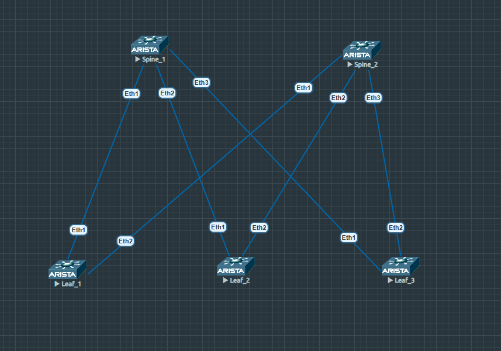

# Underlay. OSPF

### Цели:
- Настроить OSPF для Underlay сети, согласно схеме:

=
### Адрес план:

|Device|Interface|IP Address|Subnet Mask|Link type
|---|---|---|---|---|
Spine1|lo1|10.0.1.1|255.255.255.255|lo
Spine1 |Eth1|10.2.1.0|255.255.255.254|p2p Spine1 eth1 to Leaf1 eth1
Spine1 |Eth2|10.2.1.2|255.255.255.254|p2p Spine1-eth2 to Leaf2 eth1
Spine1 |Eth3|10.2.1.4|255.255.255.254|p2p Spine1-eth3 to Leaf3-eth1
Spine2 |lo1|10.0.2.1|255.255.255.255|lo
Spine2 |Eth1|10.2.2.0|255.255.255.254|p2p Spine2-eth1 to Leaf1-eth1
Spine2 |Eth2|10.2.2.2|255.255.255.254|p2p Spine2-eth2 to Leaf2-eth2
Spine2 |Eth3|10.2.2.4|255.255.255.254|p2p Spine2-eth3 to Leaf3-eth2
Leaf1 |lo1|10.0.0.1|255.255.255.255|lo
Leaf1 |Eth1|10.2.1.1|255.255.255.254|p2p leaf1-eth1 to Spine1-eth1
Leaf1 |Eth2|10.2.2.1|255.255.255.254|p2p leaf1-eth2 to Spine2-eth1
Leaf2 |lo1|10.0.0.2|255.255.255.255|lo
Leaf2 |Eth1|10.2.1.3|255.255.255.254|p2p leaf2-eth1 to Spine1-eth2
Leaf2 |Eth2|10.2.2.3|255.255.255.254|p2p leaf2-eth2 to Spine2-eth2
Leaf3 |lo1|10.0.0.3|255.255.255.255|lo
Leaf3 |Eth1|10.2.1.5|255.255.255.254|p2p leaf3-eth1 to Spine1-eth3
Leaf3 |Eth2|10.2.2.5|255.255.255.254|p2p leaf3-eth2 to Spine2-eth3
## Выполнение:
### Подготовка оборудования:
- назначаем адреса интерфейсов коммутаторам, согласно адрес плана, переводим интерфейс в L3 режим.
- включаем маршрутизацию
- включаем протокол инамической маршрутизации ospf
- Включаем Passive-interface default, добавляем используемые интерфейсы "no paasive"и используем режим point-to-point
- включаем глобальное использование BFD
- "Включаем" использование ospf на используемых интерфейсах, указваем пренадлехность area, и активируем режиим point-to-point
- Включаем и настраиваем BFD на интерфейсах.

 Конфигурация leaf1 

~~~
hostname Leaf1
!
spanning-tree mode mstp
!
interface Ethernet1
   description p2p leaf1-eth1 to Spine1-eth1
   no switchport
   ip address 10.2.1.1/31
   bfd interval 50 min-rx 50 multiplier 4
   ip ospf neighbor bfd
   ip ospf network point-to-point
   ip ospf area 0.0.0.0
!
interface Ethernet2
   description p2p leaf1-eth2 to Spine2-eth1
   no switchport
   ip address 10.2.2.1/31
   bfd interval 50 min-rx 50 multiplier 4
   ip ospf neighbor bfd
   ip ospf network point-to-point
   ip ospf area 0.0.0.0
!
interface Ethernet3
!
interface Ethernet4
!
interface Ethernet5
!
interface Ethernet6
!
interface Ethernet7
!
interface Ethernet8
!
interface Loopback1
   ip address 10.0.0.1/32
   ip ospf area 0.0.0.0
!
interface Management1
!
ip routing
!
router ospf 1
   bfd default
   passive-interface default
   no passive-interface Ethernet1
   no passive-interface Ethernet2
   max-lsa 12000
!
end
~~~

 Конфигурация leaf2 

~~~
hostname Leaf2
!
spanning-tree mode mstp
!
interface Ethernet1
   description p2p Leaf2-eth1 to Spine1-eth2
   no switchport
   ip address 10.2.1.3/31
   bfd interval 50 min-rx 50 multiplier 4
   ip ospf neighbor bfd
   ip ospf network point-to-point
   ip ospf area 0.0.0.0
!
interface Ethernet2
   description p2p leaf2-eth2 to spine2-eth2
   no switchport
   ip address 10.2.2.3/31
   bfd interval 50 min-rx 50 multiplier 4
   ip ospf neighbor bfd
   ip ospf network point-to-point
   ip ospf area 0.0.0.0
!
interface Ethernet3
!
interface Ethernet4
!
interface Ethernet5
!
interface Ethernet6
!
interface Ethernet7
!
interface Ethernet8
!
interface Loopback1
   ip address 10.0.0.2/32
   ip ospf area 0.0.0.0
!
interface Management1
!
ip routing
!
router ospf 1
   bfd default
   passive-interface default
   no passive-interface Ethernet1
   no passive-interface Ethernet2
   max-lsa 12000
!
end
~~~

 Конфигурация leaf3 

~~~
hostname Leaf3
!
spanning-tree mode mstp
!
interface Ethernet1
   description p2p leaf3-eth1 to spine1-eth3
   no switchport
   ip address 10.2.1.5/31
   bfd interval 50 min-rx 50 multiplier 4
   ip ospf neighbor bfd
   ip ospf network point-to-point
   ip ospf area 0.0.0.0
!
interface Ethernet2
   description p2p leaf3-eth2 to spine2-eth3
   no switchport
   ip address 10.2.2.5/31
   bfd interval 50 min-rx 50 multiplier 4
   ip ospf neighbor bfd
   ip ospf network point-to-point
   ip ospf area 0.0.0.0
!
interface Ethernet3
!
interface Ethernet4
!
interface Ethernet5
!
interface Ethernet6
!
interface Ethernet7
!
interface Ethernet8
!
interface Loopback1
   ip address 10.0.0.3/32
   ip ospf area 0.0.0.0
!
interface Management1
!
ip routing
!
router ospf 1
   bfd default
   passive-interface default
   no passive-interface Ethernet1
   no passive-interface Ethernet2
   max-lsa 12000
!
end

 Конфигурация spine1 

~~~
hostname Spine1
!
spanning-tree mode mstp
!
interface Ethernet1
   description p2p Spine1_eth1 to Leaf1_eth1
   no switchport
   ip address 10.2.1.0/31
   bfd interval 50 min-rx 50 multiplier 4
   ip ospf neighbor bfd
   ip ospf network point-to-point
   ip ospf area 0.0.0.0
!
interface Ethernet2
   description p2p Spine1-eth2 to Leaf2-eth1
   no switchport
   ip address 10.2.1.2/31
   bfd interval 50 min-rx 50 multiplier 4
   ip ospf neighbor bfd
   ip ospf network point-to-point
   ip ospf area 0.0.0.0
!
interface Ethernet3
   description p2p Spine1-eth3 to Leaf3-eth1
   no switchport
   ip address 10.2.1.4/31
   bfd interval 50 min-rx 50 multiplier 4
   ip ospf neighbor bfd
   ip ospf network point-to-point
   ip ospf area 0.0.0.0
!
interface Ethernet4
!
interface Ethernet5
!
interface Ethernet6
!
interface Ethernet7
!
interface Ethernet8
!
interface Loopback1
   ip address 10.0.1.1/32
   ip ospf area 0.0.0.0
!
interface Management1
!
ip routing
!
router ospf 1
   bfd default
   passive-interface default
   no passive-interface Ethernet1
   no passive-interface Ethernet2
   no passive-interface Ethernet3
   max-lsa 12000
!
end
~~~

 Конфигурация spine2 

~~~
hostname Spine2
!
spanning-tree mode mstp
!
interface Ethernet1
   description p2p Spine2-eth1 to Leaf1-eth2
   no switchport
   ip address 10.2.2.0/31
   bfd interval 50 min-rx 50 multiplier 4
   ip ospf neighbor bfd
   ip ospf network point-to-point
   ip ospf area 0.0.0.0
!
interface Ethernet2
   description p2p Spine2-eth2 to Leaf2-eth2
   no switchport
   ip address 10.2.2.2/31
   bfd interval 50 min-rx 50 multiplier 4
   ip ospf neighbor bfd
   ip ospf network point-to-point
   ip ospf area 0.0.0.0
!
interface Ethernet3
   description p2p Spine2-eth3 to Leaf3-eth2
   no switchport
   ip address 10.2.2.4/31
   bfd interval 50 min-rx 50 multiplier 4
   ip ospf neighbor bfd
   ip ospf network point-to-point
   ip ospf area 0.0.0.0
!
interface Ethernet4
!
interface Ethernet5
!
interface Ethernet6
!
interface Ethernet7
!
interface Ethernet8
!
interface Loopback1
   ip address 10.0.2.1/32
   ip ospf area 0.0.0.0
!
interface Management1
!
ip routing
!
router ospf 1
   bfd default
   passive-interface default
   no passive-interface Ethernet1
   no passive-interface Ethernet2
   no passive-interface Ethernet3
   max-lsa 12000
!
end
~~~

### Проверка связности устройств:
Leaf1
~~~
Leaf1#sh ip ospf database 
            OSPF Router with ID(10.0.0.1) (Instance ID 1) (VRF default)
                 Router Link States (Area 0.0.0.0)

Link ID         ADV Router      Age         Seq#         Checksum Link count
10.0.1.1        10.0.1.1        13          0x800002d2   0x120d   7
10.0.2.1        10.0.2.1        1           0x800002b8   0xf43b   7
10.0.0.2        10.0.0.2        17          0x80000214   0xd162   5
10.0.0.3        10.0.0.3        28          0x80000196   0x6344   5
10.0.0.1        10.0.0.1        0           0x80000382   0x4689   5
Leaf1#sh ip ospf neighbor 
Neighbor ID     Instance VRF      Pri State                  Dead Time   Address         Interface
10.0.2.1        1        default  0   FULL                   00:00:35    10.2.2.0        Ethernet2
~~~
Leaf2
~~~
Leaf2#   sh ip ospf database 
            OSPF Router with ID(10.0.0.2) (Instance ID 1) (VRF default)
                 Router Link States (Area 0.0.0.0)

Link ID         ADV Router      Age         Seq#         Checksum Link count
10.0.1.1        10.0.1.1        10          0x800002f1   0xbe77   6
10.0.2.1        10.0.2.1        4           0x800002d4   0xbc57   7
10.0.0.1        10.0.0.1        5           0x80000394   0x229b   5
10.0.0.2        10.0.0.2        7           0x80000228   0xa976   5
10.0.0.3        10.0.0.3        13          0x800001aa   0xca37   3
Leaf2#sh ip ospf neighbor 
Neighbor ID     Instance VRF      Pri State                  Dead Time   Address         Interface
10.0.2.1        1        default  0   FULL                   00:00:33    10.2.2.2        Ethernet2
~~~
Leaf3
~~~
Leaf3#sh ip ospf database 
            OSPF Router with ID(10.0.0.3) (Instance ID 1) (VRF default)
                 Router Link States (Area 0.0.0.0)

Link ID         ADV Router      Age         Seq#         Checksum Link count
10.0.1.1        10.0.1.1        7           0x80000306   0xa842   7
10.0.2.1        10.0.2.1        5           0x800002ec   0x8c6f   7
10.0.0.2        10.0.0.2        9           0x80000238   0x8986   5
10.0.0.1        10.0.0.1        14          0x8000039e   0xea5    5
10.0.0.3        10.0.0.3        3           0x800001be   0x136c   5
Leaf3#sh ip ospf neighbor 
Neighbor ID     Instance VRF      Pri State                  Dead Time   Address         Interface
10.0.1.1        1        default  0   FULL                   00:00:32    10.2.1.4        Ethernet1
~~~
Spine1
~~~
Spine1#sh ip ospf database 
            OSPF Router with ID(10.0.1.1) (Instance ID 1) (VRF default)
                 Router Link States (Area 0.0.0.0)

Link ID         ADV Router      Age         Seq#         Checksum Link count
10.0.0.1        10.0.0.1        9           0x800003af   0xb123   4
10.0.2.1        10.0.2.1        8           0x8000030d   0x1af4   6
10.0.0.2        10.0.0.2        9           0x8000024a   0x1256   3
10.0.0.3        10.0.0.3        7           0x800001d1   0x1d85   4
10.0.1.1        10.0.1.1        1           0x8000031c   0xf146   5
Spine1#sh ip ospf neighbor
Neighbor ID     Instance VRF      Pri State                  Dead Time   Address         Interface
10.0.0.1        1        default  0   FULL                   00:00:29    10.2.1.1        Ethernet1
10.0.0.2        1        default  0   FULL                   00:00:38    10.2.1.3        Ethernet2
10.0.0.3        1        default  0   FULL                   00:00:36    10.2.1.5        Ethernet3
~~~
Spine2
~~~
Spine2#sh ip ospf database 
            OSPF Router with ID(10.0.2.1) (Instance ID 1) (VRF default)
                 Router Link States (Area 0.0.0.0)

Link ID         ADV Router      Age         Seq#         Checksum Link count
10.0.1.1        10.0.1.1        3           0x80000333   0x39ba   6
10.0.0.2        10.0.0.2        5           0x80000260   0x39ae   5
10.0.0.1        10.0.0.1        10          0x800003be   0xcdc5   5
10.0.0.3        10.0.0.3        3           0x800001dc   0x6669   3
10.0.2.1        10.0.2.1        1           0x80000328   0x71b3   5
Spine2#   sh ip ospf neighbor
Neighbor ID     Instance VRF      Pri State                  Dead Time   Address         Interface
10.0.0.1        1        default  0   EXCH START             00:00:37    10.2.2.1        Ethernet1
10.0.0.2        1        default  0   FULL                   00:00:37    10.2.2.3        Ethernet2
10.0.0.3        1        default  0   FULL                   00:00:31    10.2.2.5        Ethernet3
~~~