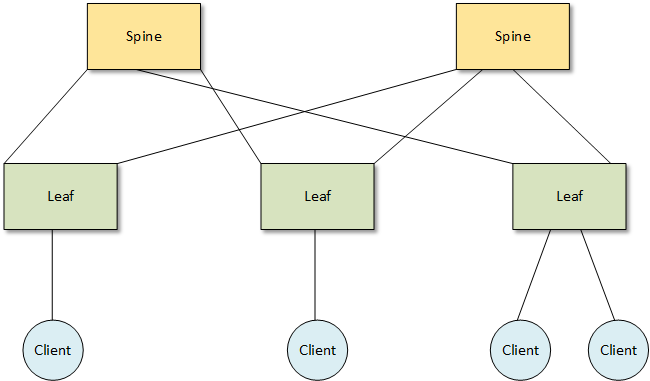

# Проектирование адресного пространства

### Цели:
- Собрать схему CLOS;
- Распределить адресное пространство;

### Реализовать схему:

=
### Таблица адресов 
Адрес план составлен по следующей схеме:

|Device|Interface|IP Address|Subnet Mask|Default Gateway
|---|---|---|---|---|
S1|VLAN3|192.168.3.11|255.255.255.0|192.168.3.1
S2|VLAN3|192.168.3.12|255.255.255.0|192.168.3.1
R3|e0/0.3|192.168.3.1|255.255.255.0|N/A|
-|e0/0.4|192.168.4.1|255.255.255.0|N/A|
-|e0/0.8|N/A|N/A|N/A|
PC-A|NIC|192.168.3.3|255.255.255.0|192.168.3.1
PC-B|NIC|192.168.4.3|255.255.255.0|192.168.4.1