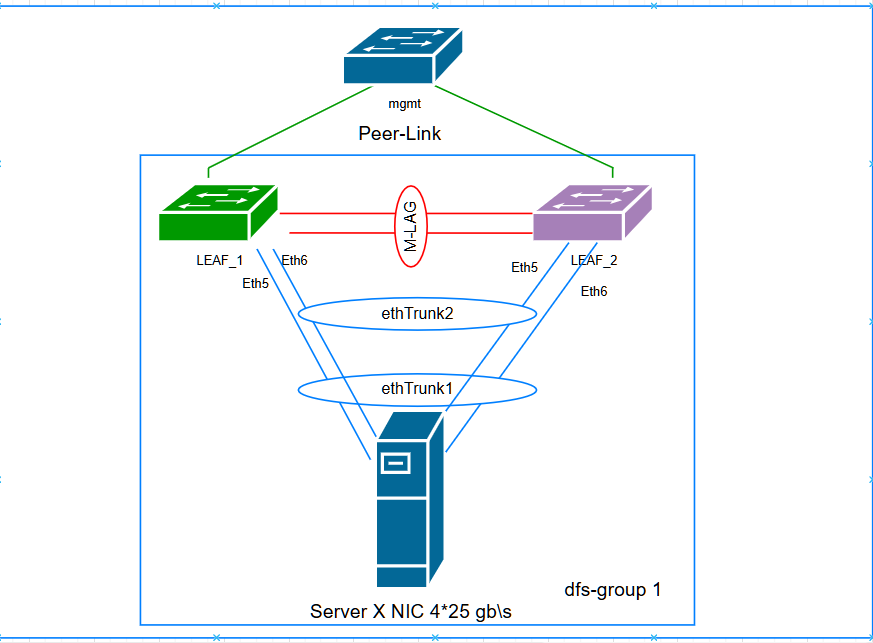
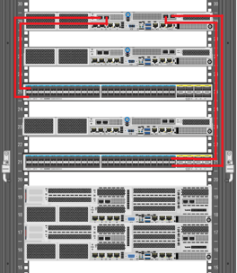

# Проектная работа.

### Цели:
-Цель проекта: – обеспечить отказоустойчивость и повышение пропускной способности серверного оборудования путем объединения интерфейсов и применении технологий VPC на уровне LEAF коммутаторов.
В случае успешной настройки, происходит равномерное распределение нагрузки на каналы, а так же обеспечиваетя отказоустойчивость.

## Выполнение:
### Подготовка оборудования:
- Необходимо задать коммутаторам адреса управления (mgmt), именно через них планируется организовать передачу пакетов состояния оборудования (heartbeat) и создать DFS группу.
- Указать в качесте STP prymary root коммутатор Leaf1
- Настроить dfs группу, указать пароль аунтетификации, задать адреса доступа, установить приоритет Master>Backup

Leaf1
~~~
interface MEth0/0/0
 ip binding vpn-instance management
 ip address 192.168.2.27 255.255.252.0
#
stp mode rstp
stp v-stp enable
stp instance 0 root primary
stp flush disable
#
dfs-group 1
 authentication-mode hmac-sha256 password 123456
 dual-active detection source ip 192.168.2.27 vpn-instance management
 priority 150
~~~
Leaf2
~~~
interface MEth0/0/0
 ip binding vpn-instance management
 ip address 192.168.2.28 255.255.252.0
#
stp mode rstp
stp v-stp enable
stp flush disable
#
dfs-group 1
 authentication-mode hmac-sha256 password 8mA-Siz8
 dual-active detection source ip 192.168.2.28 vpn-instance management
 priority 120
~~~
- Объдинить интерфейсы соединения между Leaf в транк группы 
~~~
interface 100GE1/0/5
 eth-trunk 0
#
interface 100GE1/0/6
 eth-trunk 0
#
 interface Eth-Trunk0
 trunkport 100GE1/0/5
 trunkport 100GE1/0/6
 mode lacp-static
 peer-link 1
 ~~~
- Проверка состояния состояния M-lag
~~~
<SWT-LEAF-02>   display  dfs-group 1 m-lag
*                     : Local node
Heart beat state      : OK
Node 2 *
  Dfs-Group ID        : 1
  Priority            : 120
  Dual-active Address : 192.168.2.28
  VPN-Instance        : _management_vpn_
  State               : Backup
  Causation           : -
  System ID           : c4e2-8785-c131
  SysName             : YRS00-SWT-LEAF-02
  Version             : V300R021C00SPC200
  Device Series       : CE6800-P
Node 1
  Dfs-Group ID        : 1
  Priority            : 150
  Dual-active Address : 192.168.2.27
  VPN-Instance        : _management_vpn_
  State               : Master
  Causation           : -
  System ID           : c4e2-8785-c251
  SysName             : YRS00-SWT-LEAF-01
  Version             : V300R021C00SPC200
  Device Series       : CE6800-P
~~~
### Подключение хостов планируется осуществлять по следующей схеме:

#### В качестве примера рассмотрим подключения одного сервера
- Одна пара сетевых интерфейсов хоста будет подключено в Leaf1
~~~
Leaf1
interface 25GE1/0/1
 eth-trunk 1
 lacp priority 100
#
interface 25GE1/0/2
 eth-trunk 2
 lacp priority 100
#
nterface Eth-Trunk1
 trunkport 25GE1/0/1 	
 stp edged-port enable
 mode lacp-static
 lacp timeout fast
 dfs-group 1 m-lag 1
#
interface Eth-Trunk2
 trunkport 25GE1/0/2
 stp edged-port enable
 mode lacp-static
 lacp timeout fast
 dfs-group 1 m-lag 2
 ~~~
 - другая пара сетевых инетерфейсов подклбчается в Leaf2
 ~~~
 interface 25GE1/0/1
 eth-trunk 1
 lacp priority 100
#
interface 25GE1/0/2
 eth-trunk 2
 lacp priority 100
 #
 interface Eth-Trunk1
 trunkport 25GE1/0/1 	
 stp edged-port enable
 mode lacp-static
 lacp timeout fast
 dfs-group 1 m-lag 1
#
interface Eth-Trunk2
 trunkport 25GE1/0/2
 stp edged-port enable
 mode lacp-static
 lacp timeout fast
 dfs-group 1 m-lag 2
 ~~~
-  Для реализации этого режима необходима поддержка со стороны хоста на уровне драйверов сетевых карт стандарта IEEE 802.3ad и организация Bond 4 со стороны операционной системы
- Проверяем со стороны коммутатора активность интерфейсов
 ~~~
SWT-LEAF-02>   display  dfs-group 1 m-lag brief
* - Local node

M-Lag ID     Interface      Port State    Status                Consistency-check
       1     Eth-Trunk 1    Up            active(*)-active      --
       2     Eth-Trunk 2    Up            active(*)-active      --

<YRS00-SWT-LEAF-02>   display  dfs-group 1 node 1 m-lag
* - Local node

M-Lag ID          : 1
Interface         : Eth-Trunk 1
Port State        : Up
Status            : active-active(*)
Member Port Role  : Master-Backup(*)

M-Lag ID          : 2
Interface         : Eth-Trunk 2
Port State        : Up
Status            : active-active(*)
Member Port Role  : Master-Backup(*)

<SWT-LEAF-02>display mac-address
Flags: * - Backup
       # - forwarding logical interface, operations cannot be performed based
           on the interface.
BD   : bridge-domain   Age : dynamic MAC learned time in seconds
-------------------------------------------------------------------------------
MAC Address    VLAN/VSI/BD   Learned-From        Type                Age
-------------------------------------------------------------------------------
0050-5682-1eaf 1/-/-         100GE1/0/2:1        dynamic          106550
0050-5682-470e 1/-/-         100GE1/0/2:1        dynamic          368419
0050-5682-52ed 1/-/-         100GE1/0/2:1        dynamic          368381
0050-5682-75e9 1/-/-         100GE1/0/2:1        dynamic          368449
1070-fddd-4a68 1/-/-         25GE1/0/1           dynamic             544
1070-fddd-c50e 1/-/-         Eth-Trunk0          dynamic             575
8c85-c161-00c0 1/-/-         100GE1/0/2:1        dynamic          368515
bc97-40e3-6d93 1/-/-         100GE1/0/2:1        dynamic             849
c4e2-8785-c253 1/-/-         Eth-Trunk0          dynamic             879
d4e0-53da-54f4 1/-/-         100GE1/0/2:1        dynamic          368439
~~~
- Со стороны хоста собираем виртуальный интерфейс,в группу объединяются одинаковые по скорости и режиму интерфейсы. Все физические интерфейсы используются одновременно в соответствии со спецификацией IEEE 802.3ad

